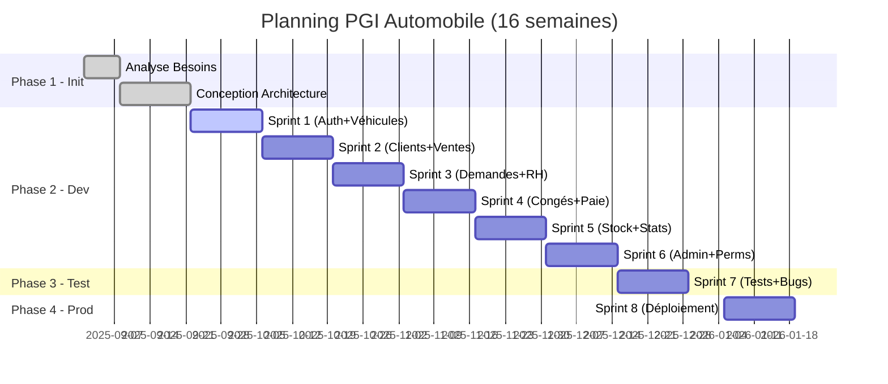

# Plan de Projet - PGI Automobile

**Projet:** Progiciel de Gestion Intégré pour Concession Automobile
**Version:** 1.0
**Date:** Novembre 2025
**Chef de Projet:** Jean MARTIN
**Commanditaire:** Direction Générale

---

## 1. Résumé Exécutif

### 1.1 Contexte

Le projet **PGI Automobile** vise à développer un progiciel web complet pour la gestion d'une concession automobile. Ce système centralisera la gestion commerciale (véhicules, ventes), les ressources humaines (paie, congés), la relation client (portail en ligne) et le pilotage (tableaux de bord).

### 1.2 Objectifs Stratégiques

| Objectif | Indicateur de Succès |
|----------|---------------------|
| **Centraliser les données** | 100% opérations saisies une seule fois |
| **Automatiser les processus** | Gain 8h/semaine par utilisateur |
| **Améliorer le pilotage** | KPI temps réel accessibles en < 5 clics |
| **Digitaliser la relation client** | 30% demandes via portail web |
| **Sécuriser les données** | 0 vulnérabilité critique (audit OWASP) |

### 1.3 Périmètre

- **8 modules fonctionnels** : Véhicules, Ventes, Demandes, Clients, RH, Stock, Statistiques, Administration
- **Technologies** : PHP 7.4+, MySQL 8.0, HTML5/CSS3/JavaScript
- **Utilisateurs** : 10 internes + 100+ clients externes
- **Durée** : 16 semaines (4 mois)
- **Budget** : 34 300€

### 1.4 Contraintes

- ✅ Pas de framework PHP (développement natif)
- ✅ Compatible hébergement mutualisé
- ✅ Responsive design (mobile/tablette/desktop)
- ✅ Respect RGPD et OWASP Top 10

---

## 2. Organisation du Projet

### 2.1 Gouvernance

#### Comité de Pilotage (COPIL)

| Rôle | Nom | Responsabilités | Fréquence Réunions |
|------|-----|-----------------|-------------------|
| **Sponsor** | Directeur Général | Validation orientations, budget, arbitrages | Mensuelle (4 COPIL) |
| **MOA** | Expert Métier | Validation fonctionnelle, recette | Bi-mensuelle |
| **Chef de Projet** | Jean MARTIN | Coordination, planning, reporting | Quotidienne (équipe) |
| **Responsable Technique** | Sophie DURAND | Architecture, qualité code | Quotidienne (équipe) |

#### Équipe Projet

| Rôle | Ressource | Affectation | Période |
|------|-----------|-------------|---------|
| **Chef de Projet** | Jean MARTIN | 50% | Semaines 1-16 |
| **Développeur Senior** | Sophie DURAND | 100% | Semaines 1-16 |
| **Développeur Junior** | Thomas BERNARD | 100% | Semaines 1-16 |
| **Designer UI/UX** | Marie CLAIRE | 25% | Semaines 1-8 |
| **Testeur QA** | Luc PETIT | 50% | Semaines 10-16 |
| **Expert Métier** | Pierre GARAGE | 10% | Semaines 1, 4, 8, 12, 16 |

#### Instances de Suivi

| Instance | Participants | Fréquence | Durée | Objectif |
|----------|-------------|-----------|-------|----------|
| **Daily Standup** | Équipe dev | Quotidienne (Lun-Ven) | 15 min | Coordination, blocages |
| **Sprint Planning** | Équipe complète | Début sprint (bi-hebdo) | 2h | Planification sprint |
| **Sprint Review** | Équipe + MOA | Fin sprint (bi-hebdo) | 1h | Démo, validation |
| **Sprint Retro** | Équipe dev | Fin sprint (bi-hebdo) | 1h | Amélioration continue |
| **COPIL** | Direction + CP | Mensuelle | 2h | Pilotage stratégique |

### 2.2 Méthodologie

**Approche** : **Agile Scrum Adapté**

**Justification** :
- Sprints de 2 semaines pour livraisons incrémentales
- Feedback utilisateurs fréquent (démos)
- Adaptation aux changements (dans périmètre gelé)
- Visibilité avancement via backlog

**Adaptations** :
- Périmètre gelé après Sprint 1 (pas de nouvelles features)
- Product Owner = Expert Métier + Chef de Projet
- Scrum Master = Chef de Projet (équipe réduite)

---

## 3. Planning Prévisionnel

### 3.1 Macro-Planning (4 mois / 16 semaines)



### 3.2 Planning Détaillé par Sprint

#### Sprint 0 : Initialisation (Semaines 1-3)

| Semaine | Activités | Livrables | Responsable |
|---------|-----------|-----------|-------------|
| **S1** | - Kick-off projet<br>- Atelier besoins (MOA)<br>- Rédaction cahier des charges | - Cahier des charges v1.0<br>- Étude de faisabilité | Chef de Projet |
| **S2-S3** | - Conception architecture<br>- Maquettes UI/UX<br>- Modélisation BDD (MCD/MLD)<br>- Setup environnements (dev/test) | - Spécifications techniques<br>- Maquettes Figma<br>- Script SQL initial<br>- Repository Git | Dev Senior + Designer |

#### Sprint 1 : Base Technique (Semaines 4-5)

**Objectif** : Fondations du système + module principal (Véhicules)

| User Story | Points | Responsable |
|------------|--------|-------------|
| En tant qu'utilisateur, je veux me connecter avec email/mot de passe | 5 | Dev Senior |
| En tant qu'admin, je veux gérer les utilisateurs (CRUD) | 8 | Dev Senior |
| En tant que vendeur, je veux voir la liste des véhicules avec filtres | 5 | Dev Junior |
| En tant que gestionnaire stock, je veux ajouter un véhicule | 8 | Dev Junior |
| En tant que gestionnaire stock, je veux modifier/supprimer un véhicule | 5 | Dev Junior |
| Système RBAC (rôles et permissions de base) | 8 | Dev Senior |
| Design responsive header/footer/navigation | 5 | Designer |

**Total Sprint 1** : 44 points (2 semaines)

#### Sprint 2 : Cycle Commercial (Semaines 6-7)

**Objectif** : Gérer le cycle de vente complet

| User Story | Points | Responsable |
|------------|--------|-------------|
| En tant que vendeur, je veux gérer les clients (CRUD) | 8 | Dev Junior |
| En tant que vendeur, je veux enregistrer une vente | 13 | Dev Senior |
| Lors d'une vente, le véhicule passe automatiquement en statut "vendu" | 3 | Dev Senior |
| Le système calcule automatiquement la marge (prix vente - prix achat) | 3 | Dev Senior |
| En tant que vendeur, je veux consulter l'historique des ventes | 5 | Dev Junior |
| En tant que vendeur, je veux générer une facture PDF | 8 | Dev Senior |

**Total Sprint 2** : 40 points

#### Sprint 3 : Portail Client + RH Base (Semaines 8-9)

**Objectif** : Demandes d'achat en ligne + gestion personnel

| User Story | Points | Responsable |
|------------|--------|-------------|
| En tant que client, je veux consulter le catalogue véhicules | 5 | Dev Junior |
| En tant que client, je veux créer un compte (inscription) | 5 | Dev Junior |
| En tant que client, je veux demander l'achat d'un véhicule | 8 | Dev Senior |
| En tant que vendeur, je veux consulter les demandes d'achat | 5 | Dev Junior |
| En tant que RH, je veux gérer les employés (CRUD) | 8 | Dev Junior |
| Design catalogue moderne (glassmorphism) | 5 | Designer |

**Total Sprint 3** : 36 points

#### Sprint 4 : RH Avancé (Semaines 10-11)

**Objectif** : Gestion congés et bulletins de paie

| User Story | Points | Responsable |
|------------|--------|-------------|
| En tant que RH, je veux gérer les demandes de congés | 8 | Dev Senior |
| En tant que RH, je veux approuver/refuser un congé | 5 | Dev Senior |
| En tant que RH, je veux créer un bulletin de paie | 13 | Dev Senior |
| Le système calcule automatiquement le net à payer (base + primes - déductions) | 5 | Dev Senior |
| En tant que RH, je veux consulter l'historique paie par employé | 3 | Dev Junior |
| Tests unitaires modules RH (PHPUnit) | 8 | Testeur QA |

**Total Sprint 4** : 42 points

#### Sprint 5 : Stock & Pilotage (Semaines 12-13)

**Objectif** : Inventaire et tableaux de bord

| User Story | Points | Responsable |
|------------|--------|-------------|
| En tant que gestionnaire stock, je veux voir l'inventaire temps réel | 8 | Dev Junior |
| Le système affiche des alertes pour véhicules en stock > 6 mois | 5 | Dev Junior |
| Le système calcule le taux de rotation du stock | 3 | Dev Junior |
| En tant que direction, je veux voir les KPI de l'année (CA, ventes, marges) | 13 | Dev Senior |
| En tant que direction, je veux voir l'évolution mensuelle (6 mois) | 8 | Dev Senior |
| En tant que direction, je veux voir le top 5 marques/clients | 5 | Dev Senior |

**Total Sprint 5** : 42 points

#### Sprint 6 : Sécurité & Admin (Semaines 14-15)

**Objectif** : Permissions avancées et sécurité

| User Story | Points | Responsable |
|------------|--------|-------------|
| En tant qu'admin, je veux configurer les permissions par rôle | 13 | Dev Senior |
| En tant qu'admin, je veux consulter les logs de connexion | 5 | Dev Junior |
| Le système enregistre chaque connexion (IP, user-agent) | 3 | Dev Junior |
| Audit sécurité OWASP Top 10 | 13 | Dev Senior + Testeur |
| Protection CSRF sur formulaires critiques | 8 | Dev Senior |
| Tests de pénétration (injections SQL, XSS) | 8 | Testeur QA |

**Total Sprint 6** : 50 points

#### Sprint 7 : Tests & Corrections (Semaines 16-17)

**Objectif** : Validation complète + corrections anomalies

| Activité | Charge | Responsable |
|----------|--------|-------------|
| Tests fonctionnels complets (tous modules) | 3 jours | Testeur QA |
| Tests de performance (charge 30 users) | 1 jour | Testeur QA |
| Corrections bugs critiques | 3 jours | Dev Senior + Junior |
| Tests de non-régression | 2 jours | Testeur QA |
| Recette utilisateur (MOA) | 2 jours | Expert Métier |
| Documentation technique finale | 2 jours | Dev Senior |

**Total Sprint 7** : 2 semaines full-time équipe

#### Sprint 8 : Déploiement & Formation (Semaines 18-19)

**Objectif** : Mise en production + accompagnement utilisateurs

| Activité | Durée | Responsable |
|----------|-------|-------------|
| Configuration serveur production | 1 jour | Dev Senior |
| Migration base de données (import données réelles) | 1 jour | Dev Senior |
| Tests post-déploiement (smoke tests) | 0.5 jour | Testeur QA |
| Formation Administrateur Système | 0.5 jour | Chef de Projet |
| Formation Vendeurs (5 personnes) | 1 jour | Chef de Projet |
| Formation RH (1 personne) | 0.5 jour | Chef de Projet |
| Formation Comptable (1 personne) | 0.5 jour | Chef de Projet |
| Création tutoriels vidéo clients | 1 jour | Designer |
| Support N1 post-production (hotline) | 2 semaines | Dev Junior |
| PV de recette signé | - | MOA + Direction |

**Total Sprint 8** : 2 semaines

### 3.3 Jalons et Livrables

| Jalon | Date Cible | Critères d'Acceptation | Livrable |
|-------|-----------|----------------------|----------|
| **J1 : Architecture Validée** | S3 (22/09) | - MCD/MLD approuvé MOA<br>- Maquettes validées<br>- Environnement dev opérationnel | Spécifications techniques v1.0 |
| **J2 : Module Véhicules Opérationnel** | S5 (06/10) | - CRUD véhicules fonctionnel<br>- Authentification OK<br>- Tests unitaires passent | Code Sprint 1 + démo |
| **J3 : Cycle de Vente Complet** | S7 (20/10) | - Vente possible de bout en bout<br>- Facture générée<br>- Marge calculée | Code Sprint 2 + démo |
| **J4 : Portail Client Live** | S9 (03/11) | - Client peut s'inscrire<br>- Demande d'achat possible<br>- Vendeur voit demandes | Code Sprint 3 + démo |
| **J5 : RH Opérationnel** | S11 (17/11) | - Paie calculée correctement<br>- Congés approuvables<br>- Zéro erreur calcul | Code Sprint 4 + démo |
| **J6 : Tableaux de Bord Actifs** | S13 (01/12) | - KPI affichés temps réel<br>- Graphiques fonctionnels<br>- Données cohérentes | Code Sprint 5 + démo |
| **J7 : Sécurité Validée** | S15 (15/12) | - 0 vulnérabilité critique<br>- Permissions OK<br>- Logs fonctionnels | Rapport audit sécurité |
| **J8 : Recette Métier** | S17 (29/12) | - Tests fonctionnels OK<br>- MOA valide<br>- Zéro bug bloquant | PV de recette signé |
| **J9 : Production** | S19 (12/01) | - Application accessible 24/7<br>- Utilisateurs formés<br>- Hotline opérationnelle | Application live + Manuel utilisateur |

---

## 4. Budget Détaillé

### 4.1 Coûts de Développement par Phase

| Phase | Activités | Charge (jours) | Coût Unitaire | Total |
|-------|-----------|---------------|---------------|-------|
| **Phase 1 : Initialisation** | Analyse + Conception | 15 j | 550€/j | 8 250€ |
| **Phase 2 : Développement** | Sprints 1-6 (12 semaines) | 48 j × 2 dev | 500€/j | 24 000€ |
| **Phase 3 : Tests** | Sprint 7 (2 semaines) | 10 j | 400€/j | 4 000€ |
| **Phase 4 : Déploiement** | Sprint 8 (2 semaines) | 5 j | 550€/j | 2 750€ |
| **Total Développement** | - | - | - | **39 000€** |

### 4.2 Coûts Additionnels

| Poste | Détail | Coût |
|-------|--------|------|
| **Design UI/UX** | 40h × 60€/h | 2 400€ |
| **Formation** | 20h × 100€/h | 2 000€ |
| **Licences logicielles** | PHPStorm (2), Figma | 450€ |
| **Hébergement Année 1** | o2switch Unique (12 mois) | 84€ |
| **Serveur de test** | VPS OVH (4 mois) | 28€ |
| **Nom de domaine** | .fr (1 an) | 10€ |
| **Audit sécurité externe** | Prestataire (optionnel) | 3 000€ |
| **Contingence (10%)** | Imprévus | 3 900€ |
| **TOTAL Global** | - | **50 872€** |

### 4.3 Répartition Budgétaire par Poste

```
Développement (77%)  ███████████████████████████████████████ 39 000€
Contingence (8%)     ████████                                 3 900€
Audit Sécurité (6%)  ██████                                   3 000€
Design UI/UX (5%)    █████                                    2 400€
Formation (4%)       ████                                     2 000€
Divers (1%)          █                                          572€
```

### 4.4 Échelonnement des Paiements

| Date | Montant | Motif |
|------|---------|-------|
| **Septembre 2025** (Démarrage) | 15 000€ | Acompte 30% |
| **Octobre 2025** (Fin Sprint 2) | 15 000€ | Avancement 30% |
| **Décembre 2025** (Fin Sprint 6) | 15 000€ | Avancement 30% |
| **Janvier 2026** (Recette) | 5 872€ | Solde 10% |

### 4.5 Suivi Budgétaire

**Indicateur** : Ratio Dépenses Réelles / Budget Prévisionnel

| Période | Budget Cumulé | Dépenses Réelles | Écart |
|---------|---------------|-----------------|-------|
| **Fin Sprint 2** | 15 000€ | À suivre | - |
| **Fin Sprint 4** | 30 000€ | À suivre | - |
| **Fin Sprint 6** | 45 000€ | À suivre | - |
| **Fin Projet** | 50 872€ | À suivre | - |

**Alerte** : Déclenchement si écart > +5% (soit +2 500€)

---

## 5. Répartition des Tâches et Responsabilités

### 5.1 Matrice RACI

**Légende** : R = Responsable (Réalise), A = Autorité (Approuve), C = Consulté, I = Informé

| Activité | Chef Projet | Dev Senior | Dev Junior | Designer | Testeur | MOA | Direction |
|----------|-------------|-----------|-----------|----------|---------|-----|-----------|
| **Cahier des charges** | R | C | I | C | I | A | I |
| **Conception architecture** | C | R | C | I | I | C | I |
| **Maquettes UI/UX** | C | C | I | R | I | A | I |
| **Développement modules** | I | R | R | I | I | C | I |
| **Tests unitaires** | I | R | R | C | C | I | I |
| **Tests fonctionnels** | C | C | C | I | R | A | I |
| **Audit sécurité** | C | R | C | I | R | I | I |
| **Déploiement production** | R | R | C | I | C | I | A |
| **Formation utilisateurs** | R | C | C | I | I | C | I |
| **Recette finale** | C | C | I | I | C | R | A |
| **Reporting COPIL** | R | C | I | I | I | I | A |

### 5.2 Plan de Charge par Ressource

#### Chef de Projet (50% - 320h)

| Activité | Charge | Période |
|----------|--------|---------|
| Initialisation projet (kick-off, planning) | 40h | S1-S3 |
| Animation sprints (planning, retro) | 96h | S4-S15 (2h × 48 sprints) |
| Reporting COPIL (préparation + réunion) | 32h | Mensuel |
| Gestion risques et suivi budget | 40h | Continu |
| Coordination équipe | 80h | Continu |
| Formation utilisateurs | 32h | S16-S17 |
| **TOTAL** | **320h** | |

#### Développeur Senior (100% - 640h)

| Activité | Charge | Période |
|----------|--------|---------|
| Conception architecture | 80h | S2-S3 |
| Setup environnements (dev/test/prod) | 24h | S2-S3 |
| Sprint 1 : Auth + RBAC + Véhicules | 80h | S4-S5 |
| Sprint 2 : Ventes + Factures | 80h | S6-S7 |
| Sprint 3 : Demandes + RH Base | 64h | S8-S9 |
| Sprint 4 : Paie + Congés | 80h | S10-S11 |
| Sprint 5 : Statistiques | 80h | S12-S13 |
| Sprint 6 : Permissions + Sécurité | 80h | S14-S15 |
| Sprint 7 : Corrections bugs | 48h | S16-S17 |
| Sprint 8 : Déploiement | 24h | S18-S19 |
| **TOTAL** | **640h** | |

#### Développeur Junior (100% - 640h)

| Activité | Charge | Période |
|----------|--------|---------|
| Formation stack projet | 16h | S2-S3 |
| Sprint 1 : Véhicules CRUD | 80h | S4-S5 |
| Sprint 2 : Clients CRUD + Ventes | 80h | S6-S7 |
| Sprint 3 : Catalogue + RH | 80h | S8-S9 |
| Sprint 4 : Congés (front) | 64h | S10-S11 |
| Sprint 5 : Stock Inventaire | 80h | S12-S13 |
| Sprint 6 : Logs + Tests | 80h | S14-S15 |
| Sprint 7 : Corrections bugs | 64h | S16-S17 |
| Sprint 8 : Support N1 | 96h | S18-S19 |
| **TOTAL** | **640h** | |

#### Designer UI/UX (25% - 80h)

| Activité | Charge | Période |
|----------|--------|---------|
| Charte graphique + Design system | 16h | S2-S3 |
| Maquettes Figma (10 écrans clés) | 32h | S2-S4 |
| Design catalogue moderne | 16h | S8 |
| Tutoriels vidéo clients | 8h | S18 |
| Supports formation | 8h | S17 |
| **TOTAL** | **80h** | |

#### Testeur QA (50% - 160h)

| Activité | Charge | Période |
|----------|--------|---------|
| Plan de tests | 16h | S10 |
| Tests unitaires (PHPUnit setup) | 24h | S10-S11 |
| Tests fonctionnels Sprint 4-6 | 40h | S10-S15 |
| Audit sécurité (OWASP) | 32h | S14-S15 |
| Tests complets + non-régression | 32h | S16-S17 |
| Tests de performance | 8h | S17 |
| Rapport de tests | 8h | S17 |
| **TOTAL** | **160h** | |

### 5.3 Compétences Requises par Rôle

| Rôle | Compétences Clés |
|------|-----------------|
| **Chef de Projet** | Gestion projet Agile, Scrum, Communication, MS Project/Excel |
| **Dev Senior** | PHP 8.x, MySQL, PDO, Sécurité web (OWASP), Architecture MVC |
| **Dev Junior** | PHP 7.x, HTML5/CSS3, JavaScript, Git, Bases MySQL |
| **Designer UI/UX** | Figma, Design systems, Responsive design, UX research |
| **Testeur QA** | Tests fonctionnels, PHPUnit, Selenium, OWASP ZAP |
| **Expert Métier** | Automobile (ventes, stock), Comptabilité, RH |

---

## 6. Gestion des Risques

### 6.1 Registre des Risques

| ID | Risque | Probabilité | Impact | Score | Propriétaire | Mitigation |
|----|--------|-------------|--------|-------|--------------|------------|
| **R01** | Dérive fonctionnelle (scope creep) | 60% | Élevé | 🔴 12 | Chef Projet | Périmètre gelé après S5, Change Request formalisé |
| **R02** | Indisponibilité dev senior (maladie, départ) | 20% | Critique | 🟠 8 | Chef Projet | Binômage permanent, backup freelance identifié |
| **R03** | Bug sécurité critique post-prod | 15% | Critique | 🟠 7 | Dev Senior | Audit OWASP S14-S15, tests pénétration |
| **R04** | Performance insuffisante (> 3s chargement) | 30% | Moyen | 🟡 6 | Dev Senior | Benchmark S9, optimisations SQL, indexes |
| **R05** | Refus utilisateurs (adoption < 50%) | 25% | Élevé | 🟠 8 | Chef Projet | Bêta test S15, formation intensive, champions |
| **R06** | Retard planning (> 2 semaines) | 40% | Moyen | 🟠 8 | Chef Projet | Buffer 10% intégré, réduction périmètre si nécessaire |
| **R07** | Bug bloquant en recette | 50% | Moyen | 🟠 10 | Testeur QA | Tests continus dès S10, hotfix process |
| **R08** | Crash serveur production | 10% | Élevé | 🟡 5 | Dev Senior | Backups quotidiens, plan de reprise (RTO 4h) |
| **R09** | Budget dépassé (> +10%) | 30% | Moyen | 🟡 6 | Chef Projet | Suivi hebdo, alerte à +5%, contingence 10% |
| **R10** | Incompatibilité navigateur (Safari) | 20% | Faible | 🟢 3 | Dev Junior | Tests cross-browser dès S4 |

**Score** = Probabilité (%) × Impact (1-5) / 100 × 20

### 6.2 Plan de Réponse aux Risques

#### R01 : Dérive Fonctionnelle

**Stratégie** : ÉVITER
- **Prévention** :
  - Périmètre gelé et signé après Sprint Planning 1
  - Toute demande nouvelle = Change Request formalisé
  - Validation COPIL requise pour ajout fonctionnel
- **Détection** :
  - Review backlog à chaque sprint planning
  - Alerte si vélocité > 110% capacité
- **Action si déclenché** :
  - Refus poli de la demande
  - Report en version 2.0 si pertinent
  - Réévaluation budget/planning si critique

#### R02 : Indisponibilité Développeur Senior

**Stratégie** : TRANSFÉRER + ATTÉNUER
- **Prévention** :
  - Binômage développeur junior sur modules critiques
  - Documentation code (PHPDoc) systématique
  - Code reviews hebdomadaires
- **Détection** :
  - Absence > 2 jours = alerte
- **Action si déclenché** :
  - J+1 : Développeur junior prend lead
  - J+3 : Activation backup freelance (Jean DUPONT, 500€/jour)
  - Réduction périmètre si > 1 semaine (module stats reporté)

#### R05 : Refus Utilisateurs

**Stratégie** : ATTÉNUER
- **Prévention** :
  - Démonstrations bi-hebdomadaires (sprints reviews)
  - Bêta test avec 3 utilisateurs clés (S15-S16)
  - Formation intensive pré-production
- **Détection** :
  - Enquête satisfaction J+30 post-prod
  - Taux d'adoption < 50% = alerte
- **Action si déclenché** :
  - Interviews individuelles (identifier freins)
  - Ajustements ergonomiques rapides
  - Formation complémentaire one-to-one
  - Mode hybride temporaire (ancien outil + PGI)

### 6.3 Suivi des Risques

**Fréquence** : Revue mensuelle (COPIL) + continue (équipe)

**Outil** : Tableau Excel partagé (OneDrive)

**Indicateurs** :
- Nombre de risques actifs
- Score de risque global (somme scores)
- Nombre de risques matérialisés

---

## 7. Dispositifs de Suivi

### 7.1 Indicateurs de Performance (KPI)

#### KPI Projet

| KPI | Cible | Fréquence Mesure | Responsable |
|-----|-------|------------------|-------------|
| **Respect planning** | ≤ 5% dérive | Hebdomadaire | Chef Projet |
| **Respect budget** | ≤ 5% écart | Hebdomadaire | Chef Projet |
| **Vélocité sprints** | 40-45 points/sprint | Bi-hebdomadaire | Dev Senior |
| **Taux bugs critiques** | < 2 bugs/sprint | Bi-hebdomadaire | Testeur QA |
| **Couverture tests** | ≥ 70% | Fin Sprint 6 | Testeur QA |
| **Satisfaction MOA** | ≥ 4/5 (sprint reviews) | Bi-hebdomadaire | Chef Projet |

#### KPI Qualité

| KPI | Cible | Outil Mesure |
|-----|-------|--------------|
| **0 vulnérabilité critique** | 100% | OWASP ZAP |
| **Temps chargement** | < 2s (moyenne) | Google Lighthouse |
| **Accessibilité** | Score AA WCAG | WAVE Evaluation Tool |
| **Code quality** | Grade A (PHPStan) | PHPStan niveau 5 |
| **Documentation code** | ≥ 80% fonctions documentées | Inspection manuelle |

### 7.2 Reporting

#### Rapport Hebdomadaire (Email)

**Destinataires** : COPIL + Équipe
**Contenu** :
- Avancement sprint en cours (% complété)
- Indicateurs clés (budget, planning, vélocité)
- Risques actifs et nouveaux
- Blocages et décisions requises
- Prochaines échéances

**Format** : 1 page A4 max

#### Tableau de Bord Visuel (Dashboard)

**Outil** : Trello ou Jira (gratuit)
**Accès** : Toute l'équipe + COPIL
**Vues** :
- Kanban backlog (To Do, In Progress, Done)
- Burndown chart sprint
- Roadmap projet (jalons)
- Registre des risques

#### Réunion COPIL Mensuelle (Présentation)

**Support** : PowerPoint (10-15 slides)
**Contenu** :
1. Résumé exécutif (1 slide)
2. Avancement vs planning (Gantt)
3. Budget (consommé vs prévisionnel)
4. Démo fonctionnalités livrées
5. Risques top 5
6. Décisions requises
7. Prochains jalons

**Durée** : 2h (présentation 45 min + Q&A)

### 7.3 Outils de Gestion de Projet

| Outil | Usage | Coût |
|-------|-------|------|
| **Trello** | Backlog Scrum, Kanban | Gratuit |
| **Git + GitHub** | Versionning code, issues, pull requests | Gratuit |
| **Google Drive** | Documentation (specs, maquettes, rapports) | Gratuit |
| **Figma** | Maquettes UI/UX | 12€/mois |
| **Excel/Google Sheets** | Budget, planning, risques | Gratuit |
| **Slack** | Communication équipe, daily standup | Gratuit |

---

## 8. Plan de Communication

### 8.1 Parties Prenantes

| Groupe | Intérêt | Influence | Stratégie Communication |
|--------|---------|-----------|------------------------|
| **Direction** | ROI, pilotage stratégique | Élevée | COPIL mensuel, démos, rapport exécutif |
| **Utilisateurs internes** | Facilité usage, gain temps | Moyenne | Newsletters, bêta test, formation |
| **Équipe projet** | Coordination, clarté objectifs | Élevée | Daily standup, sprint planning, Slack |
| **Expert métier (MOA)** | Conformité besoin métier | Élevée | Sprint reviews, validation fonctionnelle |
| **Clients externes** | Utilité portail, UX | Faible | Tutoriel vidéo, FAQ |

### 8.2 Plan de Communication Interne (Équipe)

| Canal | Contenu | Fréquence |
|-------|---------|-----------|
| **Daily Standup** (Slack) | - Fait hier<br>- Prévu aujourd'hui<br>- Blocages | Quotidien 9h (Lun-Ven) |
| **Sprint Planning** (Visio) | - Objectif sprint<br>- User stories<br>- Affectation tâches | Bi-hebdomadaire (Lundi) |
| **Sprint Review** (Visio + Démo) | - Démo fonctionnalités<br>- Feedback MOA | Bi-hebdomadaire (Vendredi) |
| **Sprint Retro** (Visio) | - Ce qui a bien marché<br>- Points d'amélioration<br>- Actions | Bi-hebdomadaire (Vendredi) |

### 8.3 Plan de Communication Externe (Utilisateurs)

| Action | Cible | Date | Support |
|--------|-------|------|---------|
| **Kick-off annonce projet** | Tous salariés | S1 | Réunion plénière 1h |
| **Newsletter #1 : Ça commence !** | Tous salariés | S4 | Email + captures écrans |
| **Newsletter #2 : Mi-parcours** | Tous salariés | S8 | Email + vidéo teaser |
| **Newsletter #3 : Bientôt prêt !** | Tous salariés | S14 | Email + date formation |
| **Recrutement bêta testeurs** | 3 volontaires | S13 | Email + incentive (bon cadeau 50€) |
| **Formation utilisateurs** | Vendeurs, RH, Comptable | S17-S18 | Présentiel + support PDF |
| **Tutoriel vidéo clients** | Clients (email BDD) | S19 | Email + lien YouTube (3 min) |
| **Lancement officiel** | Tous | S19 | Email + champagne 🍾 |

### 8.4 Gestion des Changements (Change Management)

#### Stratégie Adoption

1. **Impliquer tôt** : Bêta testeurs dès S13 (3 utilisateurs clés)
2. **Former intensivement** : 4h par rôle + support 2 semaines
3. **Champions internes** : 1 utilisateur expert par département (support N1)
4. **Quick wins** : Démontrer gains rapides (ex: facture en 2 clics vs 10 min)
5. **Hotline dédiée** : Développeur junior disponible 2 semaines post-prod

#### Résistance au Changement

**Signaux d'alerte** :
- Commentaires négatifs répétés
- Taux d'utilisation < 30% après 1 mois
- Demandes de "revenir à l'ancien système"

**Actions correctives** :
1. Entretiens individuels (identifier freins réels)
2. Ajustements ergonomiques rapides (< 48h)
3. Formation complémentaire one-to-one
4. Mode hybride temporaire (si critique)

---

## 9. Plan Qualité

### 9.1 Standards de Codage

#### Conventions PHP

- **Standard** : PSR-12 (PHP Standards Recommendations)
- **Indentation** : 4 espaces (pas de tabs)
- **Nommage** :
  - Variables : `$camelCase`
  - Fonctions : `camelCase()`
  - Constantes : `UPPER_SNAKE_CASE`
  - Classes : `PascalCase`
- **Documentation** : PHPDoc pour toutes fonctions publiques
- **Limite** : 80 caractères/ligne, 100 lignes/fonction max

#### Conventions SQL

- **Nommage tables** : `snake_case` (ex: `bulletins_paie`)
- **Clés primaires** : `id` (auto-increment)
- **Clés étrangères** : `table_id` (ex: `vehicule_id`)
- **Timestamps** : `created_at`, `updated_at`
- **Indexes** : Sur colonnes fréquemment filtrées (statut, type, email)

#### Conventions CSS

- **Méthodologie** : BEM (Block Element Modifier)
- **Variables** : Variables CSS pour thème (`:root`)
- **Responsive** : Mobile-first (min-width media queries)
- **Commentaires** : Sections clairement délimitées

### 9.2 Processus de Revue de Code

**Fréquence** : Hebdomadaire (vendredi après-midi)
**Participants** : Développeur Senior + Junior
**Outil** : GitHub Pull Requests

**Checklist** :
- [ ] Code respecte PSR-12
- [ ] Fonctions documentées (PHPDoc)
- [ ] Requêtes SQL préparées (PDO)
- [ ] Échappement XSS (`htmlspecialchars()`)
- [ ] Gestion erreurs (`try/catch`)
- [ ] Pas de code dupliqué (DRY)
- [ ] Tests unitaires passent (si applicable)

### 9.3 Tests

#### Pyramide de Tests

```
         /\
        /E2E\       Tests End-to-End (5%) - Selenium
       /------\
      /Intégra\     Tests d'Intégration (15%) - PHPUnit
     /----------\
    /  Unitaires \  Tests Unitaires (80%) - PHPUnit
   /--------------\
```

#### Plan de Tests Unitaires (PHPUnit)

**Cible** : 70% couverture code

**Modules prioritaires** :
- Calcul marge (ventes)
- Calcul net à payer (paie)
- Vérification permissions (RBAC)
- Filtres véhicules (SQL WHERE dynamique)

**Exemple** :
```php
public function testMargeCalculation() {
    $prixAchat = 15000;
    $prixVente = 18000;
    $marge = calculerMarge($prixAchat, $prixVente);
    $this->assertEquals(3000, $marge);
}
```

#### Tests Fonctionnels (Manuel)

**Outil** : Google Sheets (checklist)
**Scénarios clés** :
1. Connexion vendeur → Ajouter véhicule → Enregistrer vente → Vérifier statut "vendu"
2. Client → S'inscrire → Demander véhicule → Vendeur traite → Client notifié
3. RH → Créer bulletin paie → Vérifier calcul net → Exporter PDF

#### Tests de Performance

**Outil** : Apache JMeter
**Scénarios** :
- 30 utilisateurs simultanés
- Chargement catalogue (50 véhicules) < 2s
- Recherche véhicule < 1s
- Enregistrement vente < 1.5s

#### Tests de Sécurité

**Outils** :
- **OWASP ZAP** : Scan automatisé vulnérabilités
- **SQLMap** : Test injections SQL
- **Burp Suite** (Community) : Tests manuels XSS/CSRF

**Checklist OWASP Top 10** :
- [x] A01 Broken Access Control → RBAC testé
- [x] A03 Injection → PDO prepared statements
- [x] A07 XSS → htmlspecialchars() systématique
- [ ] A09 Logging Failures → À renforcer (S14)

### 9.4 Documentation

| Document | Responsable | Deadline | Format |
|----------|-------------|----------|--------|
| **Spécifications techniques** | Dev Senior | S3 | Markdown |
| **Modèle de données (MCD/MLD)** | Dev Senior | S3 | PDF (draw.io) |
| **Guide d'installation** | Dev Senior | S18 | Markdown |
| **Manuel administrateur** | Chef Projet | S18 | PDF |
| **Manuel utilisateur** | Chef Projet | S18 | PDF + Vidéo |
| **Documentation API** (future) | Dev Senior | V2.0 | Swagger |
| **Rapports de tests** | Testeur QA | S17 | Excel + PDF |
| **PV de recette** | MOA | S17 | PDF signé |

---

## 10. Plan de Déploiement

### 10.1 Environnements

| Environnement | Usage | URL | Accès |
|---------------|-------|-----|-------|
| **Développement** | Développeurs (local) | localhost | Équipe dev |
| **Test** | Tests QA, bêta testeurs | test.pgi-auto.fr | Équipe + bêta |
| **Production** | Utilisateurs finaux | www.pgi-auto.fr | Tous utilisateurs |

### 10.2 Stratégie de Déploiement

**Approche** : **Big Bang** (cutover weekend)

**Justification** :
- Système nouveau (pas de migration données critiques)
- Utilisateurs limités (10 internes)
- Fenêtre de tir : Weekend (samedi-dimanche S19)

**Plan de Bascule** :

| Heure | Action | Responsable |
|-------|--------|-------------|
| **Samedi 10h** | Backup complet serveur test | Dev Senior |
| **Samedi 11h** | Export données test (véhicules, clients) | Dev Senior |
| **Samedi 14h** | Configuration serveur production (Apache, PHP, MySQL) | Dev Senior |
| **Samedi 16h** | Déploiement code (Git pull) | Dev Senior |
| **Samedi 17h** | Import base de données | Dev Senior |
| **Samedi 18h** | Tests smoke (connexion, CRUD véhicule, vente) | Testeur QA |
| **Samedi 20h** | Vérification emails (SMTP) | Dev Junior |
| **Dimanche 10h** | Tests complets utilisateurs fictifs | Équipe |
| **Dimanche 14h** | GO/NO-GO production | Chef Projet |
| **Dimanche 15h** | Email utilisateurs "Système prêt lundi 9h" | Chef Projet |
| **Lundi 9h** | Ouverture officielle + hotline active | Tous |

### 10.3 Plan de Rollback

**Déclencheur** : Bug bloquant découvert avant dimanche 14h

**Actions** :
1. Restauration backup serveur (30 min)
2. Redirection DNS vers ancien système (si existe)
3. Email utilisateurs "Report mise en production"
4. Analyse cause + correction
5. Nouvelle date déploiement (J+7)

### 10.4 Sauvegardes

#### Stratégie 3-2-1

- **3** copies des données
- **2** supports différents (serveur + cloud)
- **1** copie hors site (géographiquement distant)

#### Plan de Sauvegarde Production

| Type | Fréquence | Rétention | Outil | Stockage |
|------|-----------|-----------|-------|----------|
| **Complète** (BDD + code) | Quotidienne (3h du matin) | 30 jours | mysqldump + tar | Serveur + Backblaze B2 |
| **Incrémentale** (BDD) | Toutes les 6h | 7 jours | MySQL binlogs | Serveur local |
| **Images véhicules** | Hebdomadaire | 90 jours | rsync | Backblaze B2 |

**Temps de restauration** : RTO = 4h (Recovery Time Objective)
**Perte de données max** : RPO = 6h (Recovery Point Objective)

---

## 11. Plan de Formation

### 11.1 Formations Techniques (Équipe Projet)

| Formation | Public | Durée | Date | Coût |
|-----------|--------|-------|------|------|
| **OWASP Top 10** | Dev Senior + Junior | 1 jour | S2 | Interne (gratuit) |
| **PHPUnit** | Dev Senior + Junior + Testeur | 2 jours | S8-S9 | Interne (gratuit) |
| **Scrum Refresh** | Toute équipe | 0.5 jour | S1 | Interne (gratuit) |

### 11.2 Formations Utilisateurs

#### Formation Administrateur Système

**Public** : 1 admin IT
**Durée** : 4h (1/2 journée)
**Date** : S18 (avant production)
**Contenu** :
1. Installation serveur (Apache, PHP, MySQL)
2. Configuration fichier config.php
3. Sauvegardes et restaurations
4. Monitoring (logs Apache/PHP/MySQL)
5. Procédure mise à jour
6. Troubleshooting courant

#### Formation Vendeurs

**Public** : 5 vendeurs
**Durée** : 4h (1/2 journée)
**Date** : S17
**Contenu** :
1. Connexion et navigation (30 min)
2. Gestion véhicules : ajouter, modifier, rechercher (1h)
3. Gestion clients : fiche client, historique (45 min)
4. Enregistrer une vente : workflow complet (1h)
5. Traiter demandes d'achat clients (30 min)
6. Générer facture (15 min)

**Support** : PDF + vidéo screencast

#### Formation RH

**Public** : 1 responsable RH
**Durée** : 4h (1/2 journée)
**Date** : S17
**Contenu** :
1. Gestion personnel : CRUD employés (45 min)
2. Gestion congés : créer demande, approuver/refuser (1h)
3. Bulletins de paie : créer, calcul automatique, valider (1h30)
4. Exports et rapports (30 min)
5. Masse salariale (15 min)

#### Formation Comptable

**Public** : 1 comptable
**Durée** : 2h
**Date** : S17
**Contenu** :
1. Accès tableaux de bord (30 min)
2. KPI et statistiques (CA, marges, top clients) (1h)
3. Exports CSV pour logiciel comptable (30 min)

#### Tutoriel Clients (Auto-formation)

**Public** : Tous clients (100+ personnes)
**Format** : Vidéo YouTube (3 min) + FAQ en ligne
**Date** : S19 (envoi email lancement)
**Contenu** :
1. Créer un compte (30s)
2. Consulter le catalogue (1 min)
3. Demander l'achat d'un véhicule (1 min)
4. Suivre mes demandes (30s)

### 11.3 Supports de Formation

| Support | Format | Responsable |
|---------|--------|-------------|
| **Manuel utilisateur** | PDF 30 pages | Chef Projet |
| **Vidéo screencast** | MP4 10 min | Designer |
| **Tutoriel clients** | Vidéo 3 min | Designer |
| **FAQ** | Page web HTML | Dev Junior |
| **Slides formation** | PowerPoint | Chef Projet |

---

## 12. Critères d'Acceptation Projet

### 12.1 Critères Fonctionnels

| Critère | Validé Si |
|---------|-----------|
| **8 modules opérationnels** | Tous modules accessibles et fonctionnels |
| **CRUD complet** | Create, Read, Update, Delete OK sur toutes entités |
| **Calculs automatiques** | Marges, paie, statistiques calculés sans erreur |
| **Workflow vente** | Vente enregistrable de bout en bout en < 5 min |
| **Portail client** | Client peut s'inscrire et créer demande |
| **Responsive** | Interface utilisable sur mobile/tablette/desktop |
| **Permissions** | RBAC fonctionnel, accès refusés si non autorisé |

### 12.2 Critères Techniques

| Critère | Validé Si |
|---------|-----------|
| **Performance** | Temps chargement moyen < 2s (Google Lighthouse) |
| **Sécurité** | 0 vulnérabilité critique (audit OWASP ZAP) |
| **Couverture tests** | ≥ 70% code couvert par tests unitaires |
| **Compatibilité** | Fonctionne Chrome, Firefox, Safari, Edge (versions récentes) |
| **Disponibilité** | Uptime ≥ 99% premier mois (monitoring) |

### 12.3 Critères Projet

| Critère | Validé Si |
|---------|-----------|
| **Délai** | Mise en production avant 31/01/2026 |
| **Budget** | Coûts totaux ≤ 55 000€ (budget + contingence) |
| **Documentation** | Manuel utilisateur, guide admin, doc technique livrés |
| **Formation** | 100% utilisateurs formés (feuilles émargement signées) |
| **Recette** | PV de recette signé par MOA et Direction |

### 12.4 Procédure de Recette

**Phase** : S17 (Sprint 7)
**Durée** : 3 jours
**Responsable** : Expert Métier (MOA)

**Étapes** :
1. **J1 - Tests fonctionnels** : Exécution checklist 50 scénarios
2. **J2 - Tests métier** : Validation règles de gestion (marges, paie)
3. **J3 - Tests utilisabilité** : 3 utilisateurs finaux testent
4. **J3 fin** : Réunion recette (GO/NO-GO)
5. **J4** : Signature PV de recette (si GO)

**Critère GO** : 100% tests critiques OK, max 5 bugs mineurs (cosmétiques)

---

## 13. Post-Projet

### 13.1 Garantie et Maintenance

#### Garantie (3 mois)

**Période** : 15/01/2026 - 15/04/2026
**Inclus** :
- Corrections bugs gratuits
- Hotline téléphonique (9h-18h, Lun-Ven)
- Intervention sous 24h (bugs bloquants)
- Ajustements mineurs ergonomie

#### Maintenance Évolutive (Optionnel)

**Contrat** : 12 mois renouvelable
**Coût** : 3 000€/an (forfait 30h)
**Inclus** :
- Corrections bugs non critiques
- Mises à jour sécurité PHP/MySQL
- Évolutions mineures (< 2 jours dev)
- Support email (réponse < 48h)

**Exclus** :
- Nouveaux modules (devis séparé)
- Refonte graphique
- Migration serveur

### 13.2 Rétrospective Projet

**Date** : S19 (fin projet)
**Participants** : Toute équipe projet
**Durée** : 2h

**Objectifs** :
1. Identifier ce qui a bien marché (à reproduire)
2. Identifier points d'amélioration (leçons apprises)
3. Documenter pour futurs projets

**Livrables** :
- Rapport leçons apprises (REX)
- Métriques finales (budget, délai, qualité)

### 13.3 Archivage

**Date** : Fin S19
**Responsable** : Chef de Projet

**Documents archivés** :
- Code source (Git tag v1.0.0)
- Base de données (dump production J0)
- Documentation complète (specs, manuels, tests)
- Rapports COPIL
- PV de recette signé
- Contrats et devis

**Stockage** : Google Drive (dossier "PGI Automobile - Archive Projet")
**Durée conservation** : 5 ans minimum

---

## 14. Approbation

| Rôle | Nom | Signature | Date |
|------|-----|-----------|------|
| **Sponsor (Direction)** | | | |
| **Chef de Projet** | Jean MARTIN | | |
| **MOA (Expert Métier)** | Pierre GARAGE | | |
| **Responsable Technique** | Sophie DURAND | | |

---

## Annexes

### A. Glossaire

- **PGI** : Progiciel de Gestion Intégré (ERP en anglais)
- **CRUD** : Create, Read, Update, Delete
- **RBAC** : Role-Based Access Control
- **MOA** : Maîtrise d'Ouvrage
- **COPIL** : Comité de Pilotage
- **Sprint** : Itération de 2 semaines (Scrum)
- **User Story** : Fonctionnalité décrite du point de vue utilisateur
- **Vélocité** : Points livrés par sprint (mesure productivité)
- **Backlog** : Liste priorisée des fonctionnalités à développer
- **REX** : Retour d'Expérience

### B. Références

- Scrum Guide : https://scrumguides.org/
- PSR-12 : https://www.php-fig.org/psr/psr-12/
- OWASP Top 10 : https://owasp.org/www-project-top-ten/

### C. Contacts Équipe

| Nom | Rôle | Email | Téléphone |
|-----|------|-------|-----------|
| Jean MARTIN | Chef de Projet | j.martin@pgi-auto.fr | 06 XX XX XX XX |
| Sophie DURAND | Dev Senior | s.durand@pgi-auto.fr | 06 XX XX XX XX |
| Thomas BERNARD | Dev Junior | t.bernard@pgi-auto.fr | 06 XX XX XX XX |

---

**Fin du Plan de Projet**

**Prochaine étape** : Validation COPIL et Kick-off projet (S1)
