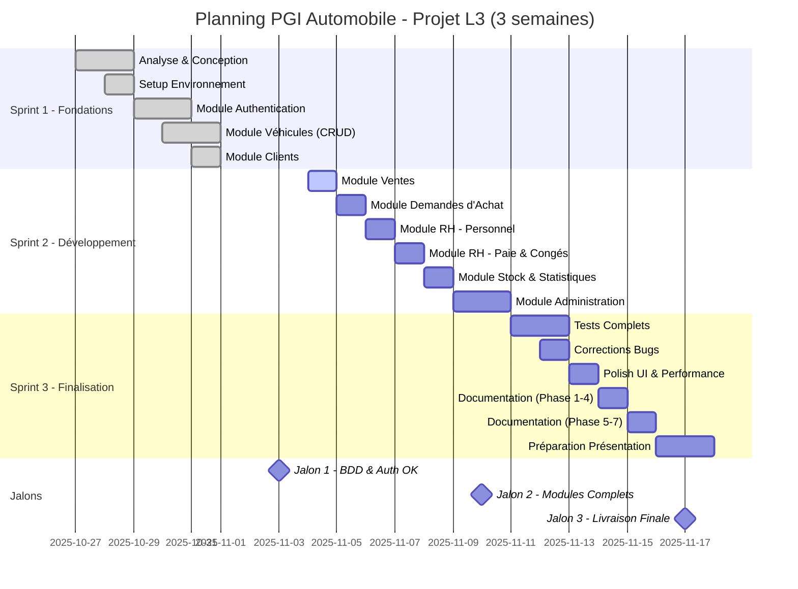

# Plan de Projet - PGI Automobile

**Projet:** Progiciel de Gestion Intégré pour Concession Automobile (Projet Académique)
**Version:** 1.0
**Date:** Novembre 2025
**Auteurs:** Thibaud THOMAS-LAMOTTE & Melissa BENZIDANE
**Contexte:** Projet de L3 - Période du 27/10/2025 au 17/11/2025 (3 semaines)

---

## 1. Résumé Exécutif

### 1.1 Contexte du Projet

Ce plan de projet détaille l'organisation et le planning du développement du **PGI Automobile**, réalisé dans le cadre d'un devoir de Licence 3 par **Thibaud THOMAS-LAMOTTE** et **Melissa BENZIDANE** sur une période de **3 semaines** (du 27 octobre au 17 novembre 2025).

### 1.2 Objectifs du Projet

| Objectif | Description |
|----------|-------------|
| **Fonctionnel** | Développer un PGI complet avec 8 modules opérationnels |
| **Technique** | Démontrer la maîtrise des technologies web (PHP/MySQL/HTML/CSS) |
| **Pédagogique** | Appliquer les connaissances acquises en L3 |
| **Professionnel** | Produire une documentation technique complète |

### 1.3 Périmètre

- **8 modules fonctionnels** : Véhicules, Ventes, Demandes, Clients, RH, Stock, Statistiques, Administration
- **Technologies** : PHP 7.4+, MySQL 8.0, HTML5/CSS3/JavaScript
- **Documentation** : 20 livrables couvrant les 7 phases du cycle SI
- **Durée** : 3 semaines (21 jours calendaires)
- **Équipe** : 2 étudiants en binôme

### 1.4 Contraintes

- ✅ Délai très court (3 semaines)
- ✅ PHP natif (sans framework)
- ✅ Responsive design obligatoire
- ✅ Documentation professionnelle complète

---

## 2. Organisation du Projet

### 2.1 Équipe Projet

| Membre | Rôle | Responsabilités Principales |
|--------|------|---------------------------|
| **Thibaud THOMAS-LAMOTTE** | Développeur Full-Stack | • Architecture système<br>• Backend PHP<br>• Base de données MySQL<br>• Sécurité (RBAC, PDO)<br>• Modules Auth, Ventes, Administration |
| **Melissa BENZIDANE** | Développeur Full-Stack | • Frontend HTML/CSS/JavaScript<br>• Design UI/UX<br>• Responsive design<br>• Tests fonctionnels<br>• Modules Stock, Statistiques |
| **Les deux** | Gestion de projet | • Planning et coordination<br>• Documentation technique<br>• Tests d'intégration<br>• Présentation finale |

### 2.2 Méthodologie de Travail

**Approche** : **Développement Agile Adapté**

**Principes appliqués** :
- Livraisons incrémentales (par module)
- Tests continus
- Communication quotidienne
- Adaptabilité
- Focus sur les fonctionnalités essentielles (MVP)

**Organisation** :
- **Sprints hebdomadaires** (3 sprints de 1 semaine)
- **Stand-up quotidien** : 15 min de synchronisation
- **Revue de code** : en binôme, au fil de l'eau
- **Versioning** : Git avec commits réguliers

### 2.3 Outils et Environnement

| Outil | Usage |
|-------|-------|
| **Git / GitHub** | Versioning du code source |
| **WAMP/XAMPP** | Serveur de développement local |
| **VS Code / PHPStorm** | IDE de développement |
| **phpMyAdmin** | Administration base de données |
| **Discord / WhatsApp** | Communication équipe |
| **Google Docs** | Documentation partagée |
| **Trello** (optionnel) | Suivi des tâches |

---

## 3. Planning Détaillé

### 3.1 Vue d'Ensemble (3 Semaines)

```
Semaine 1 (27/10-03/11)   Semaine 2 (04/11-10/11)   Semaine 3 (11/11-17/11)
┌─────────────────────┐   ┌─────────────────────┐   ┌─────────────────────┐
│ FONDATIONS          │   │ DÉVELOPPEMENT       │   │ FINALISATION        │
│                     │   │                     │   │                     │
│ • Conception        │   │ • Tous les modules  │   │ • Tests complets    │
│ • Setup technique   │   │ • Intégration       │   │ • Corrections bugs  │
│ • Auth + Véhicules  │   │ • Design responsive │   │ • Documentation     │
│ • Clients           │   │ • Statistiques      │   │ • Présentation      │
└─────────────────────┘   └─────────────────────┘   └─────────────────────┘
```

### 3.2 Diagramme de Gantt - Planning du Projet



**Légende** :
- ✅ **Done** : Tâches complétées
- 🔵 **Active** : Tâche en cours
- ⬜ **À venir** : Tâches planifiées
- 🎯 **Milestone** : Jalon majeur du projet

### 3.3 Sprint 1 : Fondations (27/10 - 03/11)

#### Objectif
Mettre en place les fondations du projet et développer les modules de base.

#### Tâches Détaillées

| Jour | Tâches | Responsable | Durée |
|------|--------|-------------|-------|
| **Lundi 27/10** | • Analyse des besoins<br>• Définition architecture<br>• Modélisation MCD/MLD | Les deux | 8h |
| **Mardi 28/10** | • Setup environnement dev<br>• Structure projet (dossiers)<br>• Base de données (création tables)<br>• Jeu de données test | Les deux | 8h |
| **Mercredi 29/10** | • Module Authentication (login/logout)<br>• Système RBAC de base<br>• Layout principal HTML/CSS | Thibaud<br><br>Melissa | 8h |
| **Jeudi 30/10** | • Module Véhicules (CRUD complet)<br>• Formulaires + validations<br>• Design interface véhicules | Thibaud<br><br>Melissa | 8h |
| **Vendredi 31/10** | • Module Clients (CRUD)<br>• Tests modules existants<br>• Corrections bugs | Thibaud<br>Les deux | 6h |
| **Week-end 01-03/11** | • Avance développement si nécessaire<br>• Veille technologique | Optionnel | - |

**Livrables Sprint 1** :
- ✅ Architecture définie et documentée
- ✅ Base de données opérationnelle (10 tables)
- ✅ Module Authentication fonctionnel
- ✅ Module Véhicules fonctionnel (CRUD complet)
- ✅ Module Clients fonctionnel
- ✅ Interface de base responsive

### 3.3 Sprint 2 : Développement (04/11 - 10/11)

#### Objectif
Développer tous les modules fonctionnels restants et l'interface utilisateur complète.

#### Tâches Détaillées

| Jour | Tâches | Responsable | Durée |
|------|--------|-------------|-------|
| **Lundi 04/11** | • Module Ventes (enregistrement vente)<br>• Calcul marge automatique<br>• Génération facture | Thibaud | 8h |
| **Mardi 05/11** | • Module Demandes d'Achat (portail client)<br>• Workflow traitement demandes<br>• Interface catalogue client | Les deux | 8h |
| **Mercredi 06/11** | • Module RH : Personnel (CRUD employés)<br>• Module RH : Congés (demandes + approbation)<br>• Design interfaces RH | Thibaud<br><br>Melissa | 8h |
| **Jeudi 07/11** | • Module RH : Bulletins de Paie<br>• Calcul automatique salaire<br>• Interface paie | Thibaud<br><br>Melissa | 8h |
| **Vendredi 08/11** | • Module Stock & Inventaire<br>• Module Statistiques & Tableaux de bord<br>• Graphiques (Chart.js ou équivalent) | Melissa<br>Melissa<br>Melissa | 8h |
| **Week-end 09-10/11** | • Module Administration (gestion users)<br>• Permissions granulaires<br>• Logs système | Thibaud | 10h |

**Livrables Sprint 2** :
- ✅ Tous les 8 modules développés
- ✅ Interface complète et cohérente
- ✅ Calculs automatiques fonctionnels
- ✅ Statistiques et graphiques opérationnels
- ✅ Système de permissions complet

### 3.4 Sprint 3 : Finalisation (11/11 - 17/11)

#### Objectif
Tests, corrections, optimisations, documentation complète et préparation de la présentation.

#### Tâches Détaillées

| Jour | Tâches | Responsable | Durée |
|------|--------|-------------|-------|
| **Lundi 11/11** | • Tests fonctionnels tous modules<br>• Liste des bugs et priorités<br>• Corrections bugs critiques | Les deux | 8h |
| **Mardi 12/11** | • Corrections bugs mineurs<br>• Optimisation requêtes SQL<br>• Amélioration responsive | Les deux | 8h |
| **Mercredi 13/11** | • Design final (polish UI)<br>• Tests cross-browser<br>• Optimisation performance | Melissa<br>Les deux | 8h |
| **Jeudi 14/11** | • Documentation technique (Phase 1-4)<br>• Guide installation<br>• Manuel utilisateur (ébauche) | Les deux | 8h |
| **Vendredi 15/11** | • Documentation technique (Phase 5-7)<br>• Finalisation manuels<br>• README projet | Les deux | 8h |
| **Week-end 16-17/11** | • Préparation présentation<br>• Support de soutenance<br>• Répétition démo | Les deux | 8h |

**Livrables Sprint 3** :
- ✅ Application complète et testée
- ✅ Bugs critiques corrigés
- ✅ Documentation technique complète (20 livrables)
- ✅ Présentation prête
- ✅ Projet finalisé et prêt à livrer

---

## 4. Répartition des Tâches

### 4.1 Modules par Développeur

#### Thibaud THOMAS-LAMOTTE

| Module | Responsabilités | Complexité |
|--------|----------------|------------|
| **Authentication** | Login, logout, sessions, sécurité | Moyenne |
| **RBAC** | Rôles, permissions, vérifications | Élevée |
| **Véhicules** | CRUD complet, filtres, calculs marges | Moyenne |
| **Clients** | CRUD, historique achats | Faible |
| **Ventes** | Enregistrement vente, mise à jour statuts, factures | Élevée |
| **RH (Paie)** | Calcul salaire automatique, bulletins | Élevée |
| **Administration** | Gestion utilisateurs, logs | Moyenne |

#### Melissa BENZIDANE

| Module | Responsabilités | Complexité |
|--------|----------------|------------|
| **Design UI/UX** | Charte graphique, layout, responsive | Moyenne |
| **Demandes Achat** | Formulaire client, workflow traitement | Moyenne |
| **RH (Congés)** | Interface demandes, approbation | Faible |
| **Stock** | Inventaire, alertes, calcul valeur | Moyenne |
| **Statistiques** | Tableaux de bord, graphiques, KPI | Élevée |
| **Tests** | Tests fonctionnels, validation UX | Moyenne |

### 4.2 Documentation par Auteur

#### Répartition des 20 Livrables

| Phase | Livrables | Responsable Principal |
|-------|-----------|---------------------|
| **Phase 1** (3) | Cahier des charges, Faisabilité, Plan projet | Les deux (co-rédaction) |
| **Phase 2** (4) | Specs fonctionnelles, techniques, UML | Thibaud (technique)<br>Melissa (UML) |
| **Phase 3** (3) | Conception archi, détaillée, maquettes | Thibaud (conception)<br>Melissa (maquettes) |
| **Phase 4** (3) | Doc technique, Plan tests, Rapport tests | Thibaud (doc)<br>Melissa (tests) |
| **Phase 5** (2) | Guide installation, Guide admin | Thibaud |
| **Phase 6** (3) | Manuel utilisateur, FAQ, Journal | Melissa |
| **Phase 7** (2) | Rapports gestion, Tableau de bord | Les deux |

### 4.3 Charge de Travail Estimée

| Activité | Thibaud | Melissa | Total |
|----------|---------|---------|-------|
| **Conception & Setup** | 12h | 12h | 24h |
| **Développement Backend** | 35h | 10h | 45h |
| **Développement Frontend** | 5h | 30h | 35h |
| **Tests & Debug** | 6h | 8h | 14h |
| **Documentation** | 12h | 15h | 27h |
| **Présentation** | 4h | 4h | 8h |
| **TOTAL** | **74h** | **79h** | **153h** |

**Moyenne** : ~25h/semaine par personne (réaliste pour un projet académique intensif)

---

## 5. Gestion des Risques

### 5.1 Registre des Risques

| Risque | Probabilité | Impact | Actions de Mitigation |
|--------|-------------|--------|--------------------|
| **Retard sur planning** | Élevée | Critique | • Prioriser MVP (fonctionnalités essentielles)<br>• Buffer time intégré<br>• Travail week-end si nécessaire |
| **Bug bloquant** | Moyenne | Élevé | • Tests continus<br>• Debugging en binôme<br>• Rollback Git si nécessaire |
| **Complexité sous-estimée** | Moyenne | Élevé | • Simplifier features si besoin<br>• Se concentrer sur l'essentiel<br>• Aide extérieure (profs, forums) |
| **Problème technique** | Faible | Moyen | • Stack connue et maîtrisée<br>• Documentation disponible<br>• Communauté active |
| **Charge de travail** | Moyenne | Moyen | • Répartition équitable<br>• Communication continue<br>• Entraide et support mutuel |

### 5.2 Plan de Contingence

#### Si retard > 2 jours

**Actions** :
1. Réunion d'urgence pour identifier le blocage
2. Repriorisation des tâches (MVP first)
3. Réduction périmètre fonctionnel si nécessaire
4. Extension horaires (week-end)

#### Si bug critique non résolu

**Actions** :
1. Rollback vers version stable précédente
2. Isolation du bug (reproduction, analyse)
3. Recherche de solution (documentation, forums, prof)
4. Workaround temporaire si solution impossible

---

## 6. Critères de Succès

### 6.1 Critères Fonctionnels

| Critère | Objectif | Validation |
|---------|----------|------------|
| **Modules complets** | 8 modules opérationnels | Tests manuels réussis |
| **Calculs corrects** | Marges, paie, stats exacts | Validation avec jeu de données |
| **Interface utilisable** | Navigation intuitive | Tests utilisateurs |
| **Responsive** | Fonctionne mobile/tablette/desktop | Tests multi-devices |

### 6.2 Critères Techniques

| Critère | Objectif | Validation |
|---------|----------|------------|
| **Sécurité** | PDO, bcrypt, RBAC | Audit code |
| **Performance** | Chargement < 3s | Tests de charge |
| **Qualité code** | Code propre, commenté | Revue de code |
| **Architecture** | Structure claire et modulaire | Documentation archi |

### 6.3 Critères Académiques

| Critère | Objectif | Validation |
|---------|----------|------------|
| **Documentation complète** | 20 livrables professionnels | Livrés et complets |
| **Respect délais** | Livraison 17/11 | Date de fin respectée |
| **Démonstration** | Présentation claire du projet | Soutenance réussie |
| **Travail d'équipe** | Collaboration efficace | Git history, répartition |

---

## 7. Communication et Suivi

### 7.1 Rituels Quotidiens

**Daily Stand-up** (15 min chaque matin)
- Qu'est-ce que j'ai fait hier ?
- Qu'est-ce que je fais aujourd'hui ?
- Ai-je des blocages ?

**Canal** : Discord / WhatsApp

### 7.2 Suivi d'Avancement

**Outil** : Trello ou liste partagée (Google Docs)

**Colonnes** :
- 📋 **À faire**
- 🚧 **En cours**
- ✅ **Terminé**
- 🐛 **Bugs**

**Mise à jour** : Quotidienne

### 7.3 Jalons et Validations

| Jalon | Date | Critères de Validation |
|-------|------|----------------------|
| **J1 : Fondations** | 03/11 | • BDD créée<br>• Auth fonctionnel<br>• Véhicules CRUD OK |
| **J2 : Modules Core** | 10/11 | • 8 modules développés<br>• Interface complète<br>• Calculs opérationnels |
| **J3 : Finalisation** | 17/11 | • Tests passés<br>• Documentation livrée<br>• Présentation prête |

---

## 8. Livrables Finaux

### 8.1 Code Source

| Livrable | Description |
|----------|-------------|
| **Repository Git** | Code source complet avec historique |
| **Documentation code** | Commentaires PHPDoc |
| **README.md** | Instructions installation et utilisation |
| **Script SQL** | Base de données + données de test |

### 8.2 Documentation Technique

**20 livrables Markdown organisés en 7 phases** :

1. **PHASE 1 - Initialisation** (3 docs)
2. **PHASE 2 - Analyse** (4 docs)
3. **PHASE 3 - Conception** (3 docs)
4. **PHASE 4 - Développement & Test** (3 docs)
5. **PHASE 5 - Déploiement** (2 docs)
6. **PHASE 6 - Maintenance** (3 docs)
7. **PHASE 7 - Aide à la Décision** (2 docs)

### 8.3 Présentation

| Livrable | Format |
|----------|--------|
| **Support de soutenance** | PowerPoint / PDF |
| **Démonstration live** | Application fonctionnelle |
| **Vidéo démo** (optionnel) | MP4 (3-5 min) |

---

## 9. Conclusion

### 9.1 Points Forts du Planning

- ✅ Planning réaliste sur 3 semaines
- ✅ Répartition équilibrée des tâches
- ✅ Méthodologie agile adaptée
- ✅ Livraisons incrémentales
- ✅ Focus sur l'essentiel (MVP)

### 9.2 Facteurs Clés de Succès

1. **Démarrage rapide** : Pas de temps à perdre, setup immédiat
2. **Communication continue** : Daily stand-up pour synchronisation
3. **Tests au fil de l'eau** : Éviter l'accumulation de bugs
4. **Documentation progressive** : Ne pas tout laisser à la fin
5. **Entraide** : Travail en binôme, support mutuel

### 9.3 Engagement

Nous, **Thibaud THOMAS-LAMOTTE** et **Melissa BENZIDANE**, nous engageons à :
- Respecter le planning défini
- Communiquer de manière transparente
- Produire un travail de qualité professionnelle
- Livrer dans les délais (17 novembre 2025)

---

**Date de démarrage** : 27 octobre 2025
**Date de livraison** : 17 novembre 2025

**Auteurs** :
- Thibaud THOMAS-LAMOTTE
- Melissa BENZIDANE

**Fin du document**
