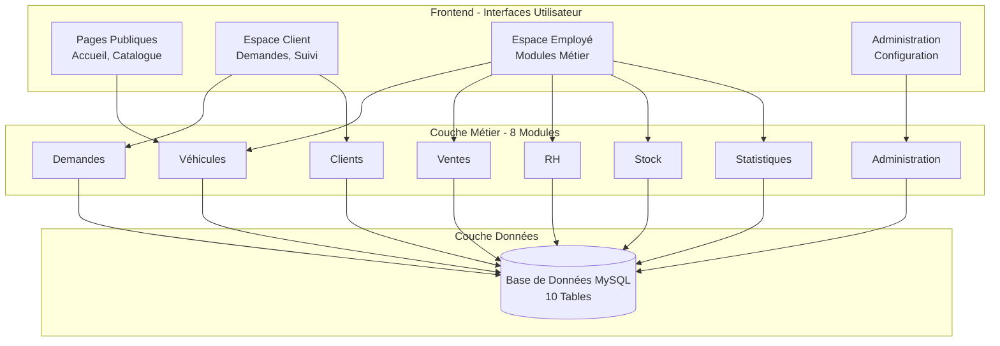
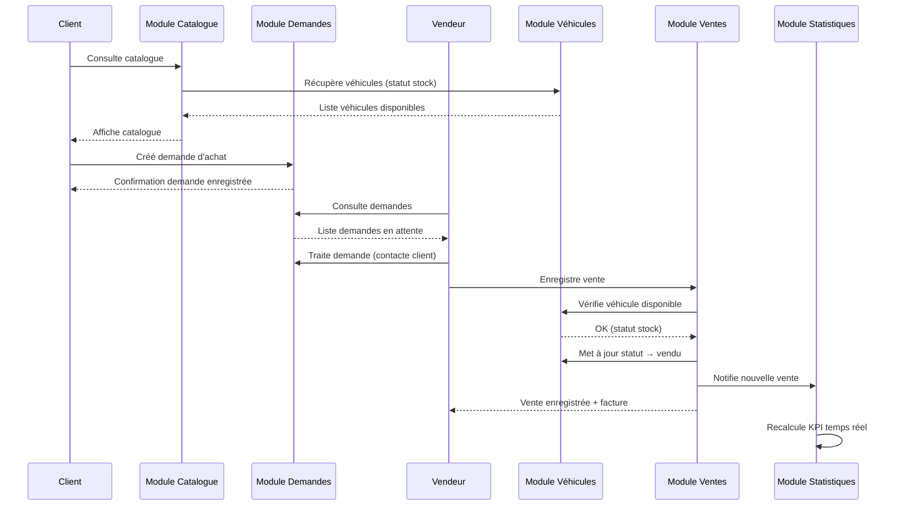
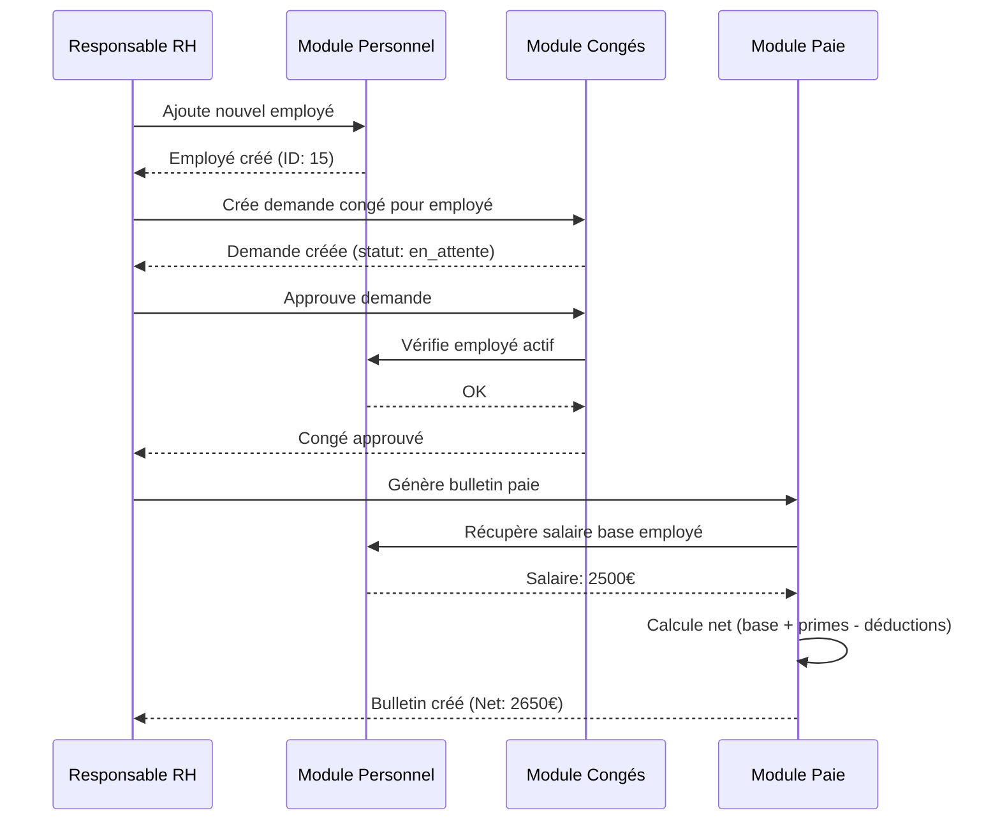

# Spécifications Fonctionnelles Générales (SFG) - PGI Automobile

**Projet:** Progiciel de Gestion Intégré pour Concession Automobile
**Version:** 1.0 (Projet Académique)
**Date:** Novembre 2025
**Auteurs:** Thibaud THOMAS-LAMOTTE & Melissa BENZIDANE
**Contexte:** Projet de L3 - Période du 27/10/2025 au 17/11/2025 (3 semaines)
**Statut:** Validé

---

## 1. Introduction

### 1.1 Objet du Document

Ce document présente les **spécifications fonctionnelles générales** du PGI Automobile. Il décrit à un niveau macro les fonctionnalités du système, les modules métier, les acteurs et leurs interactions, ainsi que les flux de données principaux.

### 1.2 Public Cible

- Maîtrise d'ouvrage (MOA)
- Chef de projet
- Équipe de développement
- Testeurs
- Utilisateurs clés

### 1.3 Périmètre Fonctionnel

Le PGI Automobile couvre **8 domaines fonctionnels** :

1. **Gestion des Véhicules** - Inventaire, caractéristiques, statuts
2. **Gestion des Ventes** - Cycle de vente, facturation, marges
3. **Gestion des Demandes d'Achat** - Portail client, workflow de traitement
4. **Gestion des Clients** - Base clients, historique
5. **Ressources Humaines** - Personnel, congés, paie
6. **Gestion du Stock** - Inventaire, alertes, rotation
7. **Statistiques & Pilotage** - KPI, tableaux de bord, rapports
8. **Administration** - Utilisateurs, rôles, permissions, logs

---

## 2. Vue d'Ensemble du Système

### 2.1 Architecture Fonctionnelle



### 2.2 Principes Fonctionnels Généraux

| Principe | Description |
|----------|-------------|
| **Centralisation** | Une seule base de données pour toutes les opérations |
| **Automatisation** | Calculs automatiques (marges, paie, statuts) |
| **Temps Réel** | Statistiques et inventaire mis à jour instantanément |
| **Traçabilité** | Logs de connexion et historique des opérations |
| **Sécurité** | Authentification requise, permissions granulaires (RBAC) |
| **Ergonomie** | Interface responsive, navigation intuitive |

---

## 3. Acteurs du Système

### 3.1 Typologie des Acteurs

#### Acteurs Internes (Employés)

| Acteur | Rôle Système | Objectifs Principaux |
|--------|--------------|---------------------|
| **Administrateur** | `admin` | - Gérer les utilisateurs et permissions<br/>- Superviser le système<br/>- Consulter les logs<br/>- Configuration globale |
| **Vendeur** | `vendeur` | - Gérer les clients<br/>- Enregistrer les ventes<br/>- Traiter les demandes d'achat<br/>- Consulter le catalogue |
| **Gestionnaire Stock** | `gestionnaire_stock` | - Gérer l'inventaire véhicules (CRUD)<br/>- Consulter alertes stock<br/>- Optimiser la rotation |
| **Comptable** | `comptable` | - Consulter les ventes et marges<br/>- Accéder aux statistiques<br/>- Exporter les données |
| **Responsable RH** | `rh` | - Gérer le personnel<br/>- Traiter les congés<br/>- Générer les bulletins de paie |

#### Acteurs Externes

| Acteur | Rôle Système | Objectifs Principaux |
|--------|--------------|---------------------|
| **Client** | `client` | - Consulter le catalogue en ligne<br/>- Créer des demandes d'achat<br/>- Suivre ses demandes<br/>- Gérer son profil |
| **Visiteur** | Non connecté | - Consulter le catalogue public<br/>- S'inscrire comme client |

### 3.2 Matrice Acteurs × Modules

| Module | Admin | Vendeur | Gest. Stock | Comptable | RH | Client | Visiteur |
|--------|-------|---------|-------------|-----------|-------|--------|----------|
| **Véhicules** | ✅ CRUD | 🔍 Lecture | ✅ CRUD | ❌ | ❌ | ❌ | ❌ |
| **Ventes** | ✅ CRUD | ✅ CRUD | ❌ | 🔍 Lecture | ❌ | ❌ | ❌ |
| **Demandes** | ✅ CRUD | ✏️ Lecture + Maj | ❌ | ❌ | ❌ | ✅ Créer + Lire | ❌ |
| **Clients** | ✅ CRUD | ✅ CRUD | ❌ | ❌ | ❌ | ✏️ Mon profil | ❌ |
| **Personnel** | ✅ CRUD | ❌ | ❌ | ❌ | ✅ CRUD | ❌ | ❌ |
| **Congés** | ✅ CRUD | ❌ | ❌ | ❌ | ✅ CRUD | ❌ | ❌ |
| **Paie** | ✅ CRUD | ❌ | ❌ | ❌ | ✅ CRUD | ❌ | ❌ |
| **Stock** | 🔍 Lecture | ❌ | ✏️ Lecture + Maj | ❌ | ❌ | ❌ | ❌ |
| **Statistiques** | 🔍 Lecture | 🔍 Lecture | ❌ | 🔍 Lecture | ❌ | ❌ | ❌ |
| **Administration** | ✅ CRUD | ❌ | ❌ | ❌ | ❌ | ❌ | ❌ |
| **Catalogue** | 🔍 Lecture | 🔍 Lecture | 🔍 Lecture | ❌ | ❌ | 🔍 Lecture | 🔍 Lecture |

**Légende** : ✅ CRUD complet | ✏️ Modification partielle | 🔍 Lecture seule | ❌ Pas d'accès

---

## 4. Modules Fonctionnels

### 4.1 Module 1 : Gestion des Véhicules

#### Objectif
Centraliser l'inventaire des véhicules avec leurs caractéristiques techniques, commerciales et leur statut de disponibilité.

#### Fonctionnalités Principales

| ID | Fonctionnalité | Description Courte |
|----|----------------|--------------------|
| **VEH-01** | Ajouter un véhicule | Saisie complète des caractéristiques (marque, modèle, année, prix, etc.) |
| **VEH-02** | Modifier un véhicule | Mise à jour des informations (prix, kilométrage, statut) |
| **VEH-03** | Supprimer un véhicule | Retrait de l'inventaire (si non vendu) |
| **VEH-04** | Consulter la liste | Affichage avec filtres (type, carburant, statut, recherche) |
| **VEH-05** | Calculer la marge | Calcul automatique : Prix Vente - Prix Achat |
| **VEH-06** | Gérer les images | Upload et affichage image véhicule |

#### Données Gérées

| Attribut | Type | Obligatoire | Exemple |
|----------|------|-------------|---------|
| Marque | Texte | ✅ | Peugeot |
| Modèle | Texte | ✅ | 208 |
| Année | Entier | ✅ | 2023 |
| Type | Énumération | ✅ | berline, SUV, sportive, utilitaire, citadine |
| Carburant | Énumération | ✅ | essence, diesel, électrique, hybride |
| Prix d'achat | Décimal | ✅ | 15 000,00 € |
| Prix de vente | Décimal | ✅ | 18 000,00 € |
| Kilométrage | Entier | ✅ | 25 000 km |
| Couleur | Texte | ❌ | Blanc Nacré |
| Immatriculation | Texte | ✅ (unique) | AB-123-CD |
| Statut | Énumération | ✅ | stock, vendu, réservé |
| Date d'arrivée | Date | ✅ | 2023-06-15 |
| Image | URL | ❌ | /assets/images/vehicules/peugeot_208.jpg |

#### Règles de Gestion

| ID | Règle |
|----|-------|
| **RG-VEH-01** | Un véhicule en statut "vendu" ne peut être modifié que par un administrateur |
| **RG-VEH-02** | L'immatriculation doit être unique dans le système |
| **RG-VEH-03** | La marge est calculée automatiquement à l'affichage (non stockée) |
| **RG-VEH-04** | Un véhicule ne peut être supprimé s'il a été vendu (intégrité historique) |

---

### 4.2 Module 2 : Gestion des Ventes

#### Objectif
Enregistrer et suivre les transactions de vente de véhicules avec calcul automatique des marges.

#### Fonctionnalités Principales

| ID | Fonctionnalité | Description Courte |
|----|----------------|--------------------|
| **VTE-01** | Enregistrer une vente | Association véhicule + client + modalités de paiement |
| **VTE-02** | Consulter l'historique | Liste de toutes les ventes avec filtres (date, client, véhicule) |
| **VTE-03** | Générer une facture | Création document PDF de facturation |
| **VTE-04** | Calculer la marge | Calcul automatique : Prix de vente - Prix d'achat du véhicule |
| **VTE-05** | Mettre à jour le statut véhicule | Passage automatique du véhicule en statut "vendu" |

#### Données Gérées

| Attribut | Type | Obligatoire | Exemple |
|----------|------|-------------|---------|
| Véhicule | Référence | ✅ | Peugeot 208 (ID: 5) |
| Client | Référence | ✅ | Jean Dupont (ID: 12) |
| Prix de vente | Décimal | ✅ | 17 500,00 € (négociable) |
| Mode de paiement | Énumération | ✅ | comptant, crédit, leasing |
| Date de vente | Date | ✅ | 2023-08-20 |
| Marge | Décimal | ✅ (calculée) | 2 500,00 € |
| Notes | Texte long | ❌ | Client satisfait, reprise ancienne voiture 3000€ |

#### Règles de Gestion

| ID | Règle |
|----|-------|
| **RG-VTE-01** | Seuls les véhicules en statut "stock" ou "réservé" peuvent être vendus |
| **RG-VTE-02** | À la validation de la vente, le véhicule passe automatiquement en statut "vendu" |
| **RG-VTE-03** | Le prix de vente peut différer du prix catalogue (négociation commerciale) |
| **RG-VTE-04** | La marge est stockée en base pour analyses statistiques futures |
| **RG-VTE-05** | Une vente ne peut être supprimée, seulement consultée (historique immuable) |

#### Workflow

```
1. Vendeur sélectionne véhicule (statut stock/réservé)
2. Vendeur sélectionne client (existant ou création nouveau)
3. Vendeur saisit prix de vente négocié et mode de paiement
4. Système calcule marge automatiquement
5. Validation vente
6. Système met à jour statut véhicule → "vendu"
7. Système enregistre vente en base
8. Génération facture possible (PDF)
```

---

### 4.3 Module 3 : Gestion des Demandes d'Achat

#### Objectif
Permettre aux clients de manifester leur intérêt pour un véhicule en ligne et aux vendeurs de traiter ces demandes.

#### Fonctionnalités Principales

| ID | Fonctionnalité | Description Courte |
|----|----------------|--------------------|
| **DEM-01** | Créer une demande (client) | Formulaire demande d'achat pour un véhicule spécifique |
| **DEM-02** | Consulter mes demandes (client) | Suivi de l'état de traitement de ses demandes |
| **DEM-03** | Lister les demandes (vendeur) | Vue d'ensemble de toutes les demandes avec filtres (statut, date) |
| **DEM-04** | Traiter une demande (vendeur) | Changement de statut, ajout de notes internes |
| **DEM-05** | Bloquer création (employés) | Seuls les clients peuvent créer des demandes |

#### Données Gérées

| Attribut | Type | Obligatoire | Exemple |
|----------|------|-------------|---------|
| Véhicule | Référence | ✅ | Peugeot 208 (ID: 5) |
| Client | Référence | ❌ | Jean Dupont (ID: 12) - Si connecté |
| Nom | Texte | ✅ | Dupont |
| Prénom | Texte | ✅ | Jean |
| Email | Email | ✅ | jean.dupont@example.com |
| Téléphone | Texte | ✅ | 06 12 34 56 78 |
| Message | Texte long | ❌ | Intéressé par ce véhicule, possibilité crédit ? |
| Statut | Énumération | ✅ | en_attente, en_cours, acceptée, refusée, finalisée |
| Notes gestionnaire | Texte long | ❌ | Client rappelé le 20/08, RDV prévu samedi |
| Traité par | Référence | ❌ | Sophie Martin (vendeur) |
| Date de traitement | Date | ❌ | 2023-08-20 14:30 |

#### Règles de Gestion

| ID | Règle |
|----|-------|
| **RG-DEM-01** | Seuls les utilisateurs avec le rôle "client" peuvent créer des demandes |
| **RG-DEM-02** | Les employés (admin, vendeur, etc.) ne peuvent pas créer de demandes |
| **RG-DEM-03** | Les notes gestionnaire ne sont visibles que par les vendeurs et administrateurs |
| **RG-DEM-04** | Une demande en statut "finalisée" ne peut plus être modifiée |
| **RG-DEM-05** | Un client non inscrit peut créer une demande (formulaire public avec coordonnées) |

#### Workflow

```
CLIENT:
1. Client consulte catalogue véhicules
2. Client clique sur "Demander ce véhicule"
3. Si non connecté → Redirection login ou formulaire guest
4. Client remplit formulaire (message, coordonnées)
5. Soumission → Statut "en_attente"

VENDEUR:
6. Vendeur consulte liste demandes (filtre "en_attente")
7. Vendeur ouvre détail demande
8. Vendeur contacte client (téléphone/email)
9. Vendeur change statut → "en_cours"
10. Vendeur ajoute notes privées
11. Après négociation → Statut "acceptée" ou "refusée"
12. Si vente conclue → Statut "finalisée"
```

---

### 4.4 Module 4 : Gestion des Clients

#### Objectif
Constituer et maintenir une base de données clients pour le suivi commercial et la relation client.

#### Fonctionnalités Principales

| ID | Fonctionnalité | Description Courte |
|----|----------------|--------------------|
| **CLI-01** | Ajouter un client | Création fiche client complète |
| **CLI-02** | Modifier un client | Mise à jour coordonnées, informations |
| **CLI-03** | Supprimer un client | Retrait de la base (si aucune vente associée) |
| **CLI-04** | Consulter la liste | Affichage avec recherche (nom, email, téléphone) |
| **CLI-05** | Consulter l'historique | Ventes et demandes d'achat associées au client |
| **CLI-06** | Inscription client | Formulaire public de création de compte |

#### Données Gérées

| Attribut | Type | Obligatoire | Exemple |
|----------|------|-------------|---------|
| Nom | Texte | ✅ | Dupont |
| Prénom | Texte | ✅ | Jean |
| Email | Email | ✅ (unique) | jean.dupont@example.com |
| Téléphone | Texte | ✅ | 06 12 34 56 78 |
| Adresse | Texte | ❌ | 123 rue de la République |
| Ville | Texte | ❌ | Paris |
| Code postal | Texte | ❌ | 75001 |
| Date de naissance | Date | ❌ | 1985-05-15 |
| Date d'inscription | Timestamp | ✅ (auto) | 2023-06-01 10:30:00 |

#### Règles de Gestion

| ID | Règle |
|----|-------|
| **RG-CLI-01** | L'email client doit être unique dans le système |
| **RG-CLI-02** | Un client ne peut être supprimé s'il a des ventes ou demandes associées |
| **RG-CLI-03** | L'inscription client crée automatiquement un compte utilisateur (rôle "client") |
| **RG-CLI-04** | Un client peut modifier son propre profil via "Mon Profil" |

---

### 4.5 Module 5 : Ressources Humaines

#### Objectif
Gérer le personnel de la concession : employés, congés et bulletins de paie.

#### Fonctionnalités Principales

| ID | Fonctionnalité | Description Courte |
|----|----------------|--------------------|
| **RH-01** | Gérer le personnel | CRUD employés avec informations complètes |
| **RH-02** | Gérer les congés | Création, approbation/refus des demandes de congés |
| **RH-03** | Gérer les bulletins de paie | Création et calcul automatique du net à payer |
| **RH-04** | Consulter la masse salariale | Vue d'ensemble des coûts RH |
| **RH-05** | Historique paie par employé | Accès à tous les bulletins d'un employé |

#### 4.5.1 Sous-module : Personnel

**Données Gérées**

| Attribut | Type | Obligatoire | Exemple |
|----------|------|-------------|---------|
| Nom | Texte | ✅ | Martin |
| Prénom | Texte | ✅ | Sophie |
| Poste | Texte | ✅ | Vendeuse |
| Salaire | Décimal | ✅ | 2 500,00 € |
| Email | Email | ❌ | sophie.martin@concession.fr |
| Téléphone | Texte | ❌ | 06 98 76 54 32 |
| Date d'embauche | Date | ✅ | 2020-03-01 |
| Statut | Énumération | ✅ | actif, congé, inactif |

#### 4.5.2 Sous-module : Congés

**Données Gérées**

| Attribut | Type | Obligatoire | Exemple |
|----------|------|-------------|---------|
| Employé | Référence | ✅ | Sophie Martin (ID: 3) |
| Type | Texte | ✅ | CP, RTT, Maladie |
| Date début | Date | ✅ | 2023-08-01 |
| Date fin | Date | ✅ | 2023-08-15 |
| Statut | Énumération | ✅ | en_attente, approuvé, refusé |
| Commentaire (employé) | Texte | ❌ | Vacances d'été |
| Commentaire (gestion) | Texte | ❌ | Approuvé, faible activité en août |

**Workflow Congés**

```
1. Employé (ou RH) crée demande de congé → Statut "en_attente"
2. RH consulte liste des demandes en attente
3. RH approuve ou refuse avec commentaire
4. Statut passe à "approuvé" ou "refusé"
```

#### 4.5.3 Sous-module : Bulletins de Paie

**Données Gérées**

| Attribut | Type | Obligatoire | Exemple |
|----------|------|-------------|---------|
| Employé | Référence | ✅ | Sophie Martin (ID: 3) |
| Mois de référence | Date | ✅ | 2023-08-01 |
| Salaire de base | Décimal | ✅ | 2 500,00 € |
| Primes | Décimal | ❌ | 300,00 € |
| Déductions | Décimal | ❌ | 150,00 € |
| Net à payer | Décimal | ✅ (calculé) | 2 650,00 € |
| Statut | Énumération | ✅ | brouillon, validé |
| Notes | Texte | ❌ | Prime performance mensuelle |

**Calcul Automatique**

```
Net à payer = Salaire de base + Primes - Déductions
```

#### Règles de Gestion

| ID | Règle |
|----|-------|
| **RG-RH-01** | Le net à payer est calculé automatiquement : base + primes - déductions |
| **RG-RH-02** | Un bulletin de paie en statut "validé" ne peut plus être modifié |
| **RG-RH-03** | Seul le responsable RH et l'admin peuvent approuver/refuser des congés |
| **RG-RH-04** | Un employé en statut "inactif" ne peut recevoir de nouveau bulletin de paie |

---

### 4.6 Module 6 : Gestion du Stock

#### Objectif
Fournir une vue d'ensemble temps réel de l'inventaire avec alertes et indicateurs de rotation.

#### Fonctionnalités Principales

| ID | Fonctionnalité | Description Courte |
|----|----------------|--------------------|
| **STK-01** | Vue inventaire temps réel | Statistiques globales du stock (quantité, valeur) |
| **STK-02** | Répartition par type | Graphique véhicules par type (berline, SUV, etc.) |
| **STK-03** | Répartition par carburant | Graphique véhicules par motorisation |
| **STK-04** | Valeur totale du stock | Somme des prix d'achat des véhicules en stock |
| **STK-05** | Marge potentielle | Somme des marges théoriques (prix vente - prix achat) |
| **STK-06** | Alertes stock longue durée | Liste véhicules en stock > 6 mois |
| **STK-07** | Taux de rotation | Calcul : Ventes / Stock moyen |

#### Indicateurs Calculés

| Indicateur | Formule | Exemple |
|------------|---------|---------|
| **Nombre véhicules en stock** | COUNT(véhicules WHERE statut = 'stock') | 25 véhicules |
| **Valeur totale stock** | SUM(prix_achat WHERE statut = 'stock') | 375 000,00 € |
| **Marge potentielle** | SUM(prix_vente - prix_achat WHERE statut = 'stock') | 75 000,00 € |
| **Durée moyenne en stock** | AVG(DATEDIFF(NOW(), date_arrivee)) | 45 jours |
| **Véhicules > 6 mois** | COUNT(véhicules WHERE DATEDIFF > 180 AND statut = 'stock') | 3 véhicules (⚠️ alerte) |

#### Règles de Gestion

| ID | Règle |
|----|-------|
| **RG-STK-01** | Une alerte est déclenchée si un véhicule reste en stock > 6 mois |
| **RG-STK-02** | Seuls les véhicules en statut "stock" sont comptabilisés dans l'inventaire |
| **RG-STK-03** | La valeur stock est recalculée en temps réel à chaque affichage |

---

### 4.7 Module 7 : Statistiques & Tableaux de Bord

#### Objectif
Fournir à la direction et aux managers des indicateurs de performance en temps réel.

#### Fonctionnalités Principales

| ID | Fonctionnalité | Description Courte |
|----|----------------|--------------------|
| **STAT-01** | KPI année en cours | Nombre ventes, CA, panier moyen, marge totale |
| **STAT-02** | Évolution mensuelle | Graphique évolution sur 6 derniers mois |
| **STAT-03** | Top 5 marques vendues | Classement marques par volume de ventes |
| **STAT-04** | Top 5 clients | Classement clients par montant d'achats |
| **STAT-05** | Performance commerciale | Taux de transformation demandes → ventes |
| **STAT-06** | Indicateurs stock | Rotation, durée moyenne, alertes |

#### KPI Calculés

| KPI | Formule | Exemple |
|-----|---------|---------|
| **Nombre de ventes (année)** | COUNT(ventes WHERE YEAR(date_vente) = YEAR(NOW())) | 48 ventes |
| **Chiffre d'affaires (année)** | SUM(prix_vente WHERE YEAR(date_vente) = YEAR(NOW())) | 720 000,00 € |
| **Panier moyen** | CA / Nombre de ventes | 15 000,00 € |
| **Marge totale** | SUM(marge WHERE YEAR(date_vente) = YEAR(NOW())) | 120 000,00 € |
| **Taux de marge** | (Marge totale / CA) × 100 | 16,67 % |

#### Graphiques

1. **Évolution mensuelle du CA** (6 derniers mois) - Graphique en courbe
2. **Répartition ventes par type véhicule** - Graphique en camembert
3. **Top 5 marques** - Graphique en barres horizontales
4. **Top 5 clients** - Graphique en barres

#### Règles de Gestion

| ID | Règle |
|----|-------|
| **RG-STAT-01** | Les statistiques sont calculées en temps réel (pas de cache) |
| **RG-STAT-02** | Seuls les rôles admin, vendeur et comptable ont accès aux statistiques |
| **RG-STAT-03** | L'évolution mensuelle affiche les 6 derniers mois glissants |

---

### 4.8 Module 8 : Administration Système

#### Objectif
Gérer les utilisateurs, les rôles, les permissions et la sécurité du système.

#### Fonctionnalités Principales

| ID | Fonctionnalité | Description Courte |
|----|----------------|--------------------|
| **ADM-01** | Gérer les utilisateurs | CRUD complet des comptes utilisateurs |
| **ADM-02** | Gérer les rôles | Attribution des rôles (admin, vendeur, etc.) |
| **ADM-03** | Gérer les permissions | Matrice permissions (rôle × module × action) |
| **ADM-04** | Consulter les logs | Historique des connexions avec IP et user-agent |
| **ADM-05** | Activer/désactiver un utilisateur | Toggle statut (actif/inactif/suspendu) |

#### Données Utilisateur

| Attribut | Type | Obligatoire | Exemple |
|----------|------|-------------|---------|
| Nom | Texte | ✅ | Martin |
| Prénom | Texte | ✅ | Sophie |
| Email | Email | ✅ (unique) | sophie.martin@concession.fr |
| Mot de passe | Hash bcrypt | ✅ | $2y$10$... |
| Rôle | Énumération | ✅ | admin, vendeur, gestionnaire_stock, comptable, rh, client |
| Statut | Énumération | ✅ | actif, inactif, suspendu |
| Avatar | URL | ❌ | https://ui-avatars.com/api/?name=SM |
| Téléphone | Texte | ❌ | 06 98 76 54 32 |
| Dernière connexion | Timestamp | ❌ (auto) | 2023-08-20 14:30:00 |

#### Système de Permissions (RBAC)

**Structure Permission**

| Attribut | Exemple |
|----------|---------|
| Rôle | vendeur |
| Module | vehicules |
| Action | read |

**Actions Possibles**

- `create` : Créer
- `read` : Lire
- `update` : Mettre à jour
- `delete` : Supprimer

**Permissions par Défaut** (si table vide)

```
admin → * (wildcard, accès complet)
vendeur → vehicules:read, clients:*, ventes:*, demandes:read,update
gestionnaire_stock → vehicules:*, stock:read,update
comptable → ventes:read, statistiques:read
rh → rh:*, conges:*, paie:*
client → catalogue:read, demandes:create,read
```

#### Logs de Connexion

| Attribut | Type | Exemple |
|----------|------|---------|
| Utilisateur | Référence | Sophie Martin (ID: 3) |
| Action | Énumération | connexion, deconnexion, tentative_echec |
| Adresse IP | Texte | 192.168.1.100 |
| User Agent | Texte | Mozilla/5.0 (Windows NT 10.0; Win64; x64)... |
| Date/Heure | Timestamp | 2023-08-20 09:00:00 |

#### Règles de Gestion

| ID | Règle |
|----|-------|
| **RG-ADM-01** | Seul l'administrateur peut créer, modifier ou supprimer des utilisateurs |
| **RG-ADM-02** | Les mots de passe sont hashés en bcrypt (algorithme PASSWORD_BCRYPT) |
| **RG-ADM-03** | Toutes les connexions (réussies ou échouées) sont loggées |
| **RG-ADM-04** | Un utilisateur inactif ne peut se connecter au système |
| **RG-ADM-05** | Les permissions sont vérifiées à chaque accès (module + action) |

---

## 5. Flux de Données entre Modules

### 5.1 Flux Principal : Cycle de Vente



### 5.2 Flux Secondaire : Gestion RH Complète



### 5.3 Dépendances entre Modules

| Module Source | Module Cible | Type de Lien | Description |
|--------------|-------------|--------------|-------------|
| Ventes | Véhicules | Forte | Mise à jour statut véhicule lors d'une vente |
| Ventes | Clients | Forte | Association vente ↔ client obligatoire |
| Ventes | Statistiques | Lecture | Recalcul KPI à chaque nouvelle vente |
| Demandes | Véhicules | Lecture | Affichage infos véhicule dans demande |
| Demandes | Clients | Faible | Association demande ↔ client (optionnelle si guest) |
| Stock | Véhicules | Lecture | Calculs basés sur statut et dates véhicules |
| Paie | Personnel | Forte | Récupération salaire base employé |
| Congés | Personnel | Forte | Vérification employé actif |
| Administration | Tous modules | Transverse | Vérification permissions avant accès |

---

## 6. Règles de Gestion Transverses

### 6.1 Sécurité

| ID | Règle |
|----|-------|
| **RG-SEC-01** | Tous les utilisateurs doivent être authentifiés pour accéder aux modules métier |
| **RG-SEC-02** | Les permissions sont vérifiées à chaque action (create, read, update, delete) |
| **RG-SEC-03** | Les mots de passe sont stockés en hash bcrypt (jamais en clair) |
| **RG-SEC-04** | Toutes les connexions sont tracées dans les logs (IP, user-agent, timestamp) |
| **RG-SEC-05** | Les requêtes SQL utilisent exclusivement PDO avec requêtes préparées (anti-injection) |
| **RG-SEC-06** | Toutes les sorties utilisateur sont échappées avec `htmlspecialchars()` (anti-XSS) |

### 6.2 Intégrité des Données

| ID | Règle |
|----|-------|
| **RG-INT-01** | Un véhicule vendu ne peut être supprimé (intégrité historique) |
| **RG-INT-02** | Un client ayant des ventes ou demandes ne peut être supprimé |
| **RG-INT-03** | Une vente ne peut être supprimée (historique immuable) |
| **RG-INT-04** | Les identifiants (email, immatriculation) doivent être uniques |
| **RG-INT-05** | Les montants sont stockés en décimales (DECIMAL 10,2) pour éviter erreurs d'arrondi |

### 6.3 Ergonomie

| ID | Règle |
|----|-------|
| **RG-ERG-01** | L'interface est responsive (mobile, tablette, desktop) |
| **RG-ERG-02** | Les formulaires affichent des messages d'erreur clairs en cas de saisie invalide |
| **RG-ERG-03** | Les actions critiques (suppression) demandent une confirmation |
| **RG-ERG-04** | Un feedback visuel (alerte verte/rouge) est affiché après chaque action |
| **RG-ERG-05** | Les listes longues sont paginées (50 éléments par page) |

### 6.4 Performance

| ID | Règle |
|----|-------|
| **RG-PERF-01** | Le temps de chargement d'une page ne doit pas excéder 2 secondes |
| **RG-PERF-02** | Les statistiques sont calculées à la demande (pas de cache initial) |
| **RG-PERF-03** | Les images véhicules sont optimisées (max 1 MB, compression JPEG/WebP) |

---

## 7. Interfaces Externes

### 7.1 Interfaces Utilisateur

| Interface | Public | Accès | Description |
|-----------|--------|-------|-------------|
| **Pages publiques** | Visiteurs | Non authentifié | Accueil, catalogue véhicules |
| **Espace client** | Clients | Authentification requise | Mes demandes, mon profil |
| **Espace employé** | Internes | Authentification + permissions | Modules métier (véhicules, ventes, RH, etc.) |
| **Administration** | Admin uniquement | Authentification admin | Gestion utilisateurs, permissions, logs |

### 7.2 Interfaces Données (Futures)

| Interface | Format | Usage |
|-----------|--------|-------|
| **Export CSV** | CSV | Export données pour comptabilité externe |
| **API REST** (V2.0) | JSON | Intégration applications tierces |
| **Webhooks** (V2.0) | HTTP POST | Notifications temps réel (nouvelle vente, demande) |

---

## 8. Volumétrie et Performances

### 8.1 Volumétrie Estimée

| Entité | Volume Annuel | Volume 5 ans | Croissance |
|--------|---------------|--------------|------------|
| **Véhicules** | 100 | 500 | +20%/an |
| **Ventes** | 50 | 250 | +15%/an |
| **Clients** | 80 | 400 | +20%/an |
| **Demandes d'achat** | 150 | 750 | +25%/an |
| **Employés** | 10 | 15 | +10%/an |
| **Utilisateurs** | 15 | 30 | +15%/an |
| **Logs connexion** | 5 000 | 25 000 | +20%/an |

### 8.2 Contraintes de Performance

| Métrique | Objectif | Mesure |
|----------|----------|--------|
| **Temps de chargement page** | < 2s | Google Lighthouse |
| **Temps réponse formulaire** | < 1s | Tests manuels |
| **Utilisateurs simultanés** | 20-30 | Apache JMeter |
| **Requêtes SQL moyennes** | < 50ms | MySQL Slow Query Log |
| **Taille base de données** | < 5 GB | MySQL (5 ans) |

---

## 9. Évolutions Futures Envisagées

### 9.1 Version 2.0 (Court Terme - 6 mois)

- **Module Comptabilité Avancée** : Grand livre, plan comptable, écritures
- **Notifications Email** : Alertes automatiques (nouvelle demande, congé approuvé)
- **Export PDF** : Rapports statistiques, bulletins de paie
- **Multi-images** : Galerie photos par véhicule (actuellement 1 image)

### 9.2 Version 3.0 (Moyen Terme - 12 mois)

- **API REST** : Intégration applications tierces (site web vitrine, mobile)
- **Module SAV/Atelier** : Gestion réparations, pièces détachées
- **CRM Avancé** : Segmentation clients, campagnes marketing
- **Tableau de bord temps réel** : WebSockets pour mise à jour live

### 9.3 Version 4.0 (Long Terme - 24 mois)

- **Multi-établissements** : Gestion plusieurs concessions
- **Business Intelligence** : Prédictions ventes, analyses avancées
- **Application Mobile** : iOS/Android pour vendeurs terrain
- **Intégration ERP Tiers** : SAP, Sage pour grandes structures

---

## 10. Validation et Approbation

### 10.1 Critères de Validation

Ce document est validé si :

- [ ] Toutes les fonctionnalités principales sont décrites
- [ ] Les acteurs et leurs droits sont clairement identifiés
- [ ] Les flux de données entre modules sont cohérents
- [ ] Les règles de gestion sont exhaustives et non ambiguës
- [ ] La MOA valide que les besoins métier sont couverts

### 10.2 Signatures

| Rôle | Nom | Signature | Date |
|------|-----|-----------|------|
| **Maîtrise d'Ouvrage** | | | |
| **Chef de Projet** | | | |
| **Responsable Technique** | | | |
| **Expert Métier** | | | |

---

## Annexes

### A. Glossaire

- **CRUD** : Create, Read, Update, Delete (opérations de base)
- **RBAC** : Role-Based Access Control (contrôle d'accès par rôles)
- **KPI** : Key Performance Indicator (indicateur clé de performance)
- **CA** : Chiffre d'Affaires
- **MOA** : Maîtrise d'Ouvrage
- **PDO** : PHP Data Objects (accès base de données sécurisé)
- **XSS** : Cross-Site Scripting (vulnérabilité web)

### B. Références

- Cahier des charges PGI Automobile v1.0
- Étude de faisabilité PGI Automobile v1.0
- Analyse du code source (11 244 lignes)

---

**Fin du document**

**Prochaine étape** : Spécifications Fonctionnelles Détaillées (SFD)
