# Modèles UML - PGI Automobile

**Projet:** Progiciel de Gestion Intégré pour Concession Automobile
**Version:** 1.0 (Projet Académique)
**Date:** Novembre 2025
**Auteurs:** Thibaud & Melissa
**Contexte:** Projet de L3 - Période du 27/10/2025 au 17/11/2025 (3 semaines)
**Statut:** Validé

---

## 1. Introduction

### 1.1 Objet du Document

Ce document présente les modèles UML (Unified Modeling Language) du PGI Automobile. Ces diagrammes offrent une représentation graphique de l'architecture, des interactions et de la structure du système.

### 1.2 Diagrammes Inclus

| Type de Diagramme | Description | Objectif |
|------------------|-------------|----------|
| **Cas d'Utilisation** | Interactions acteurs-système | Vue fonctionnelle globale |
| **Classes** | Structure données et relations | Architecture objet |
| **Séquence** | Déroulement processus métier | Workflows détaillés |
| **Activité** | Flux de travail | Processus métier |
| **Déploiement** | Infrastructure technique | Architecture physique |
| **États-Transitions** | Cycles de vie entités | Règles de gestion |

### 1.3 Notation

Les diagrammes sont présentés en **syntaxe Mermaid** (compatible Markdown, rendu avec plugins ou outils en ligne).

---

## 2. Diagrammes de Cas d'Utilisation

### 2.1 Vue d'Ensemble Générale

```mermaid
graph TB
    subgraph Acteurs Externes
        VISIT[👤 Visiteur]
        CLIENT[👤 Client]
    end

    subgraph Acteurs Internes
        ADMIN[👨‍💼 Administrateur]
        VEND[👨‍💼 Vendeur]
        GEST[👨‍💼 Gest. Stock]
        COMPTA[👨‍💼 Comptable]
        RH[👨‍💼 Resp. RH]
    end

    subgraph Système PGI Automobile
        UC_CATALOG[Consulter Catalogue]
        UC_INSCR[S'inscrire]
        UC_DEMANDE[Créer Demande Achat]
        UC_GERER_VEH[Gérer Véhicules]
        UC_VENTE[Enregistrer Vente]
        UC_TRAITER_DEM[Traiter Demandes]
        UC_GERER_CLI[Gérer Clients]
        UC_STATS[Consulter Statistiques]
        UC_GERER_PERS[Gérer Personnel]
        UC_CONGES[Gérer Congés]
        UC_PAIE[Gérer Paie]
        UC_ADMIN[Administrer Système]
        UC_PERMS[Gérer Permissions]
    end

    VISIT --> UC_CATALOG
    VISIT --> UC_INSCR

    CLIENT --> UC_CATALOG
    CLIENT --> UC_DEMANDE

    VEND --> UC_GERER_CLI
    VEND --> UC_VENTE
    VEND --> UC_TRAITER_DEM
    VEND --> UC_STATS

    GEST --> UC_GERER_VEH

    COMPTA --> UC_STATS

    RH --> UC_GERER_PERS
    RH --> UC_CONGES
    RH --> UC_PAIE

    ADMIN --> UC_ADMIN
    ADMIN --> UC_PERMS
    ADMIN -.->|hérite tout| UC_GERER_VEH
    ADMIN -.->|hérite tout| UC_VENTE
```

### 2.2 Cas d'Utilisation Détaillé : Module Ventes

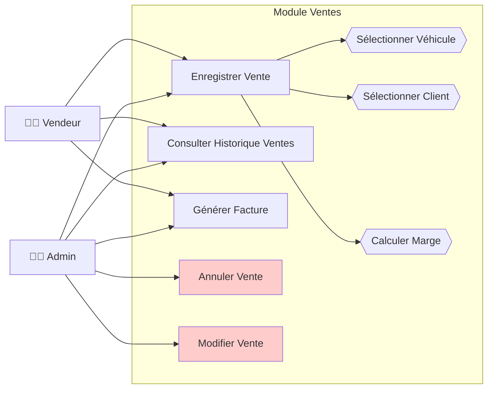
```mermaid
graph LR
    VEND[👨‍💼 Vendeur]
    ADMIN[👨‍💼 Admin]

    subgraph Module Ventes
        UC1[Enregistrer Vente]
        UC2[Consulter Historique Ventes]
        UC3[Générer Facture]
        UC4[Annuler Vente]
        UC5[Modifier Vente]

        UC1 --> INC1{{Sélectionner Véhicule}}
        UC1 --> INC2{{Sélectionner Client}}
        UC1 --> INC3{{Calculer Marge}}
    end

    VEND --> UC1
    VEND --> UC2
    VEND --> UC3

    ADMIN --> UC1
    ADMIN --> UC2
    ADMIN --> UC3
    ADMIN --> UC4
    ADMIN --> UC5

    style UC4 fill:#ffcccc
    style UC5 fill:#ffcccc
```

**Légende** : Rouge = Fonctionnalité future / Admin uniquement

### 2.3 Cas d'Utilisation Détaillé : Module Demandes d'Achat

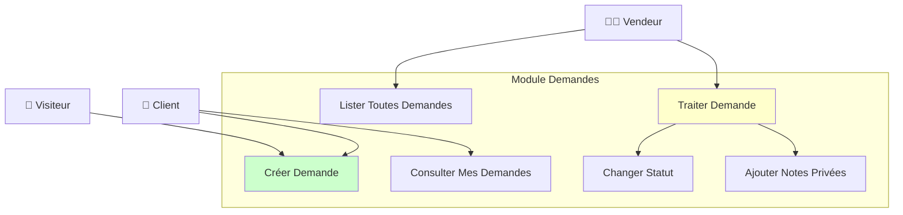
```mermaid
graph TB
    CLIENT[👤 Client]
    VEND[👨‍💼 Vendeur]
    VISIT[👤 Visiteur]

    subgraph Module Demandes
        UC1[Créer Demande]
        UC2[Consulter Mes Demandes]
        UC3[Lister Toutes Demandes]
        UC4[Traiter Demande]
        UC5[Changer Statut]
        UC6[Ajouter Notes Privées]

        UC4 --> UC5
        UC4 --> UC6
    end

    CLIENT --> UC1
    CLIENT --> UC2

    VISIT --> UC1

    VEND --> UC3
    VEND --> UC4

    style UC1 fill:#ccffcc
    style UC4 fill:#ffffcc
```

**Légende** : Vert = Public | Jaune = Interne

---

## 3. Diagramme de Classes

### 3.1 Modèle Complet

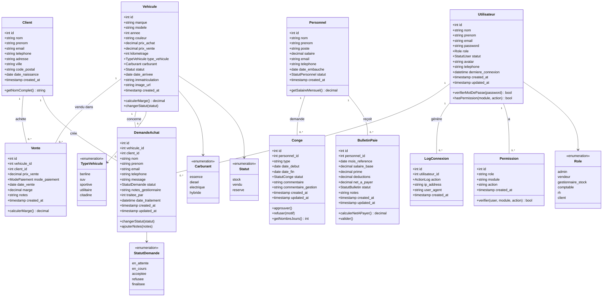
```mermaid
classDiagram
    class Vehicule {
        +int id
        +string marque
        +string modele
        +int annee
        +string couleur
        +decimal prix_achat
        +decimal prix_vente
        +int kilometrage
        +TypeVehicule type_vehicule
        +Carburant carburant
        +Statut statut
        +date date_arrivee
        +string immatriculation
        +string image_url
        +timestamp created_at
        +calculerMarge() decimal
        +changerStatut(statut)
    }

    class Client {
        +int id
        +string nom
        +string prenom
        +string email
        +string telephone
        +string adresse
        +string ville
        +string code_postal
        +date date_naissance
        +timestamp created_at
        +getNomComplet() string
    }

    class Vente {
        +int id
        +int vehicule_id
        +int client_id
        +decimal prix_vente
        +ModePaiement mode_paiement
        +date date_vente
        +decimal marge
        +string notes
        +timestamp created_at
        +calculerMarge() decimal
    }

    class DemandeAchat {
        +int id
        +int vehicule_id
        +int client_id
        +string nom
        +string prenom
        +string email
        +string telephone
        +string message
        +StatutDemande statut
        +string notes_gestionnaire
        +int traitee_par
        +datetime date_traitement
        +timestamp created_at
        +timestamp updated_at
        +changerStatut(statut)
        +ajouterNotes(notes)
    }

    class Utilisateur {
        +int id
        +string nom
        +string prenom
        +string email
        +string password
        +Role role
        +StatutUser statut
        +string avatar
        +string telephone
        +datetime derniere_connexion
        +timestamp created_at
        +timestamp updated_at
        +verifierMotDePasse(password) bool
        +hasPermission(module, action) bool
    }

    class Permission {
        +int id
        +string role
        +string module
        +string action
        +timestamp created_at
        +verifier(user, module, action) bool
    }

    class Personnel {
        +int id
        +string nom
        +string prenom
        +string poste
        +decimal salaire
        +string email
        +string telephone
        +date date_embauche
        +StatutPersonnel statut
        +timestamp created_at
        +getSalaireMensuel() decimal
    }

    class Conge {
        +int id
        +int personnel_id
        +string type
        +date date_debut
        +date date_fin
        +StatutConge statut
        +string commentaire
        +string commentaire_gestion
        +timestamp created_at
        +timestamp updated_at
        +approuver()
        +refuser(motif)
        +getNombreJours() int
    }

    class BulletinPaie {
        +int id
        +int personnel_id
        +date mois_reference
        +decimal salaire_base
        +decimal prime
        +decimal deductions
        +decimal net_a_payer
        +StatutBulletin statut
        +string notes
        +timestamp created_at
        +timestamp updated_at
        +calculerNetAPayer() decimal
        +valider()
    }

    class LogConnexion {
        +int id
        +int utilisateur_id
        +ActionLog action
        +string ip_address
        +string user_agent
        +timestamp created_at
    }

    %% Relations
    Vehicule "1" -- "0..*" Vente : vendu dans
    Vehicule "1" -- "0..*" DemandeAchat : concerne
    Client "1" -- "0..*" Vente : achète
    Client "1" -- "0..*" DemandeAchat : crée
    Utilisateur "1" -- "0..*" DemandeAchat : traite
    Utilisateur "1" -- "0..*" LogConnexion : génère
    Utilisateur "1" -- "0..*" Permission : a
    Personnel "1" -- "0..*" Conge : demande
    Personnel "1" -- "0..*" BulletinPaie : reçoit

    %% Énumérations
    class TypeVehicule {
        <<enumeration>>
        berline
        suv
        sportive
        utilitaire
        citadine
    }

    class Carburant {
        <<enumeration>>
        essence
        diesel
        electrique
        hybride
    }

    class Statut {
        <<enumeration>>
        stock
        vendu
        reserve
    }

    class Role {
        <<enumeration>>
        admin
        vendeur
        gestionnaire_stock
        comptable
        rh
        client
    }

    class StatutDemande {
        <<enumeration>>
        en_attente
        en_cours
        acceptee
        refusee
        finalisee
    }

    Vehicule --> TypeVehicule
    Vehicule --> Carburant
    Vehicule --> Statut
    Utilisateur --> Role
    DemandeAchat --> StatutDemande
```

### 3.2 Classes Principales - Détail

#### Classe `Vehicule`

| Attribut | Type | Contrainte |
|----------|------|------------|
| id | int | PK, AUTO_INCREMENT |
| marque | string(50) | NOT NULL |
| modele | string(50) | NOT NULL |
| annee | int | NOT NULL |
| prix_achat | decimal(10,2) | NOT NULL |
| prix_vente | decimal(10,2) | NOT NULL |
| immatriculation | string(20) | NOT NULL, UNIQUE |
| statut | enum | NOT NULL, DEFAULT 'stock' |

**Méthodes** :
- `calculerMarge()` : Retourne `prix_vente - prix_achat`
- `changerStatut(statut)` : Met à jour le statut (stock → vendu)

#### Classe `Vente`

| Attribut | Type | Contrainte |
|----------|------|------------|
| id | int | PK |
| vehicule_id | int | FK → vehicules(id) |
| client_id | int | FK → clients(id) |
| prix_vente | decimal(10,2) | NOT NULL |
| marge | decimal(10,2) | NOT NULL (calculée) |

**Méthodes** :
- `calculerMarge()` : `prix_vente - vehicule.prix_achat`

---

## 4. Diagrammes de Séquence

### 4.1 Séquence : Enregistrer une Vente

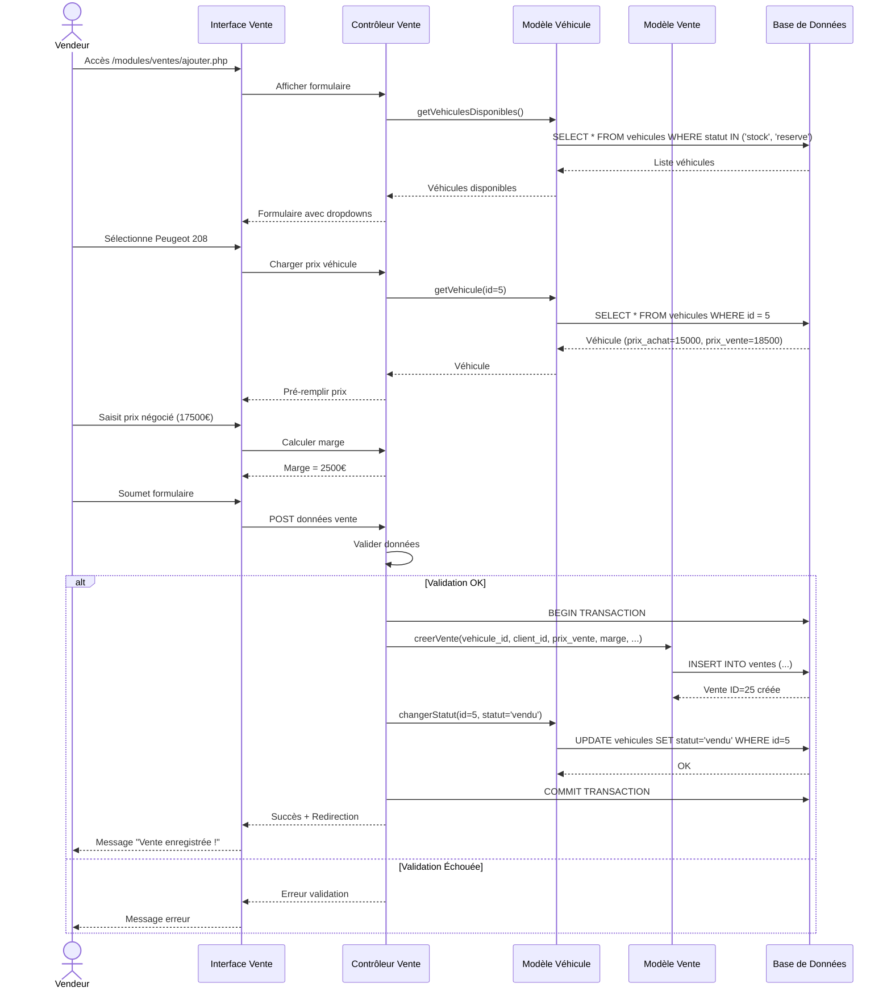
```mermaid
sequenceDiagram
    actor V as Vendeur
    participant UI as Interface Vente
    participant CTRL as Contrôleur Vente
    participant MODEL_VEH as Modèle Véhicule
    participant MODEL_VTE as Modèle Vente
    participant BDD as Base de Données

    V->>UI: Accès /modules/ventes/ajouter.php
    UI->>CTRL: Afficher formulaire
    CTRL->>MODEL_VEH: getVehiculesDisponibles()
    MODEL_VEH->>BDD: SELECT * FROM vehicules WHERE statut IN ('stock', 'reserve')
    BDD-->>MODEL_VEH: Liste véhicules
    MODEL_VEH-->>CTRL: Véhicules disponibles
    CTRL-->>UI: Formulaire avec dropdowns

    V->>UI: Sélectionne Peugeot 208
    UI->>CTRL: Charger prix véhicule
    CTRL->>MODEL_VEH: getVehicule(id=5)
    MODEL_VEH->>BDD: SELECT * FROM vehicules WHERE id = 5
    BDD-->>MODEL_VEH: Véhicule (prix_achat=15000, prix_vente=18500)
    MODEL_VEH-->>CTRL: Véhicule
    CTRL-->>UI: Pré-remplir prix

    V->>UI: Saisit prix négocié (17500€)
    UI->>CTRL: Calculer marge
    CTRL-->>UI: Marge = 2500€

    V->>UI: Soumet formulaire
    UI->>CTRL: POST données vente
    CTRL->>CTRL: Valider données

    alt Validation OK
        CTRL->>BDD: BEGIN TRANSACTION
        CTRL->>MODEL_VTE: creerVente(vehicule_id, client_id, prix_vente, marge, ...)
        MODEL_VTE->>BDD: INSERT INTO ventes (...)
        BDD-->>MODEL_VTE: Vente ID=25 créée

        CTRL->>MODEL_VEH: changerStatut(id=5, statut='vendu')
        MODEL_VEH->>BDD: UPDATE vehicules SET statut='vendu' WHERE id=5
        BDD-->>MODEL_VEH: OK

        CTRL->>BDD: COMMIT TRANSACTION
        CTRL-->>UI: Succès + Redirection
        UI-->>V: Message "Vente enregistrée !"
    else Validation Échouée
        CTRL-->>UI: Erreur validation
        UI-->>V: Message erreur
    end
```

### 4.2 Séquence : Client Crée une Demande d'Achat

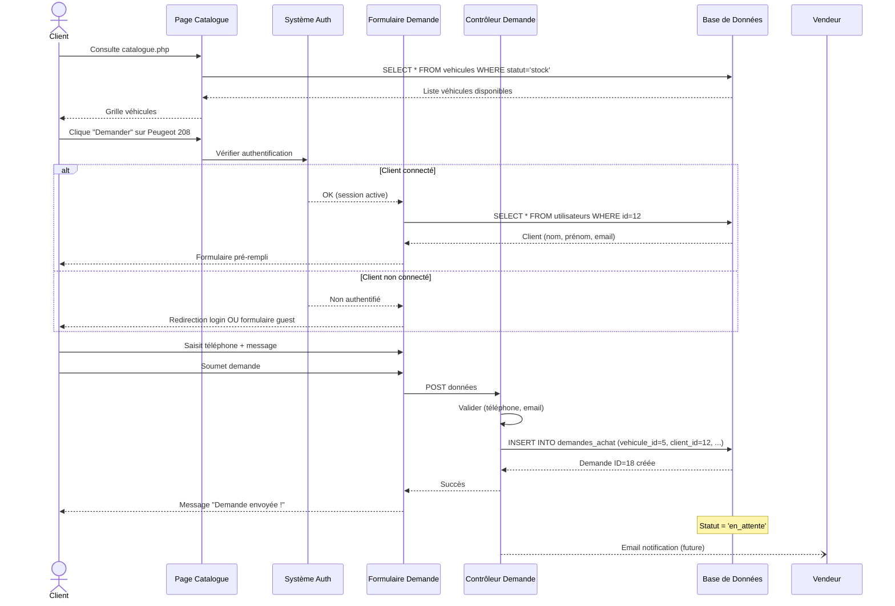
```mermaid
sequenceDiagram
    actor C as Client
    participant CAT as Page Catalogue
    participant AUTH as Système Auth
    participant FORM as Formulaire Demande
    participant CTRL as Contrôleur Demande
    participant BDD as Base de Données

    C->>CAT: Consulte catalogue.php
    CAT->>BDD: SELECT * FROM vehicules WHERE statut='stock'
    BDD-->>CAT: Liste véhicules disponibles
    CAT-->>C: Grille véhicules

    C->>CAT: Clique "Demander" sur Peugeot 208
    CAT->>AUTH: Vérifier authentification

    alt Client connecté
        AUTH-->>FORM: OK (session active)
        FORM->>BDD: SELECT * FROM utilisateurs WHERE id=12
        BDD-->>FORM: Client (nom, prénom, email)
        FORM-->>C: Formulaire pré-rempli
    else Client non connecté
        AUTH-->>FORM: Non authentifié
        FORM-->>C: Redirection login OU formulaire guest
    end

    C->>FORM: Saisit téléphone + message
    C->>FORM: Soumet demande

    FORM->>CTRL: POST données
    CTRL->>CTRL: Valider (téléphone, email)
    CTRL->>BDD: INSERT INTO demandes_achat (vehicule_id=5, client_id=12, ...)
    BDD-->>CTRL: Demande ID=18 créée
    CTRL-->>FORM: Succès
    FORM-->>C: Message "Demande envoyée !"

    Note over BDD: Statut = 'en_attente'

    %% Notification future
    CTRL--)Vendeur: Email notification (future)
```

### 4.3 Séquence : Authentification Utilisateur

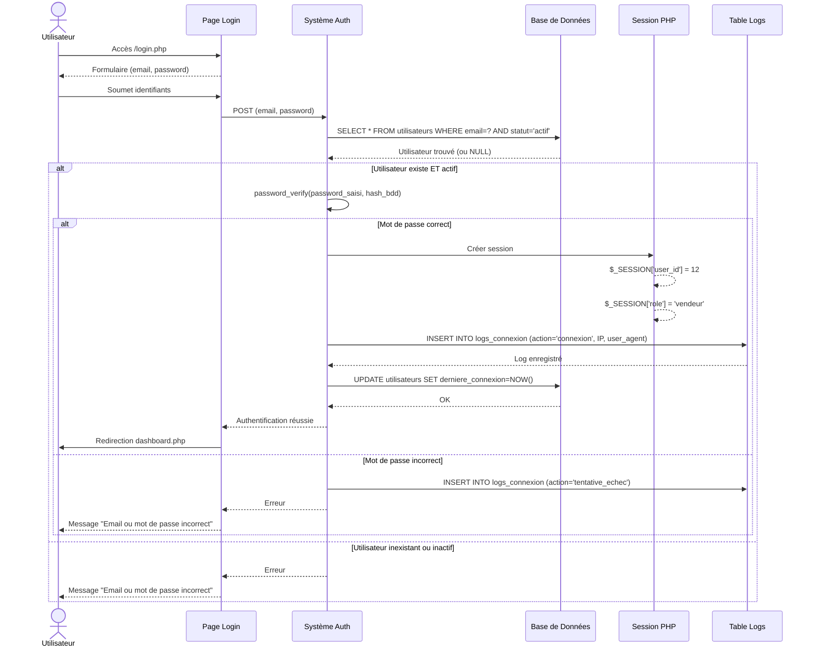
```mermaid
sequenceDiagram
    actor U as Utilisateur
    participant LOGIN as Page Login
    participant AUTH as Système Auth
    participant BDD as Base de Données
    participant SESS as Session PHP
    participant LOGS as Table Logs

    U->>LOGIN: Accès /login.php
    LOGIN-->>U: Formulaire (email, password)

    U->>LOGIN: Soumet identifiants
    LOGIN->>AUTH: POST (email, password)
    AUTH->>BDD: SELECT * FROM utilisateurs WHERE email=? AND statut='actif'
    BDD-->>AUTH: Utilisateur trouvé (ou NULL)

    alt Utilisateur existe ET actif
        AUTH->>AUTH: password_verify(password_saisi, hash_bdd)

        alt Mot de passe correct
            AUTH->>SESS: Créer session
            SESS-->>SESS: $_SESSION['user_id'] = 12
            SESS-->>SESS: $_SESSION['role'] = 'vendeur'

            AUTH->>LOGS: INSERT INTO logs_connexion (action='connexion', IP, user_agent)
            LOGS-->>AUTH: Log enregistré

            AUTH->>BDD: UPDATE utilisateurs SET derniere_connexion=NOW()
            BDD-->>AUTH: OK

            AUTH-->>LOGIN: Authentification réussie
            LOGIN->>U: Redirection dashboard.php
        else Mot de passe incorrect
            AUTH->>LOGS: INSERT INTO logs_connexion (action='tentative_echec')
            AUTH-->>LOGIN: Erreur
            LOGIN-->>U: Message "Email ou mot de passe incorrect"
        end
    else Utilisateur inexistant ou inactif
        AUTH-->>LOGIN: Erreur
        LOGIN-->>U: Message "Email ou mot de passe incorrect"
    end
```

### 4.4 Séquence : Génération Bulletin de Paie

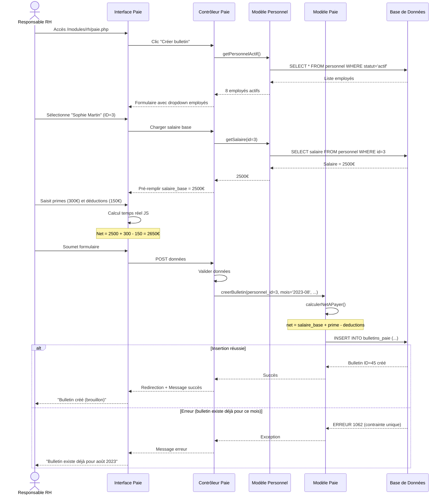
```mermaid
sequenceDiagram
    actor RH as Responsable RH
    participant UI as Interface Paie
    participant CTRL as Contrôleur Paie
    participant MODEL_PERS as Modèle Personnel
    participant MODEL_PAIE as Modèle Paie
    participant BDD as Base de Données

    RH->>UI: Accès /modules/rh/paie.php
    UI->>CTRL: Clic "Créer bulletin"
    CTRL->>MODEL_PERS: getPersonnelActif()
    MODEL_PERS->>BDD: SELECT * FROM personnel WHERE statut='actif'
    BDD-->>MODEL_PERS: Liste employés
    MODEL_PERS-->>CTRL: 8 employés actifs
    CTRL-->>UI: Formulaire avec dropdown employés

    RH->>UI: Sélectionne "Sophie Martin" (ID=3)
    UI->>CTRL: Charger salaire base
    CTRL->>MODEL_PERS: getSalaire(id=3)
    MODEL_PERS->>BDD: SELECT salaire FROM personnel WHERE id=3
    BDD-->>MODEL_PERS: Salaire = 2500€
    MODEL_PERS-->>CTRL: 2500€
    CTRL-->>UI: Pré-remplir salaire_base = 2500€

    RH->>UI: Saisit primes (300€) et déductions (150€)
    UI->>UI: Calcul temps réel JS
    Note over UI: Net = 2500 + 300 - 150 = 2650€

    RH->>UI: Soumet formulaire
    UI->>CTRL: POST données
    CTRL->>CTRL: Valider données

    CTRL->>MODEL_PAIE: creerBulletin(personnel_id=3, mois='2023-08', ...)
    MODEL_PAIE->>MODEL_PAIE: calculerNetAPayer()
    Note over MODEL_PAIE: net = salaire_base + prime - deductions

    MODEL_PAIE->>BDD: INSERT INTO bulletins_paie (...)

    alt Insertion réussie
        BDD-->>MODEL_PAIE: Bulletin ID=45 créé
        MODEL_PAIE-->>CTRL: Succès
        CTRL-->>UI: Redirection + Message succès
        UI-->>RH: "Bulletin créé (brouillon)"
    else Erreur (bulletin existe déjà pour ce mois)
        BDD-->>MODEL_PAIE: ERREUR 1062 (contrainte unique)
        MODEL_PAIE-->>CTRL: Exception
        CTRL-->>UI: Message erreur
        UI-->>RH: "Bulletin existe déjà pour août 2023"
    end
```

---

## 5. Diagrammes d'Activité

### 5.1 Activité : Processus de Vente Complet

```mermaid
flowchart TD
    START([Début])
    START --> CHOIX_VEH[Vendeur sélectionne véhicule]
    CHOIX_VEH --> VERIF_DISPO{Véhicule<br/>disponible ?}

    VERIF_DISPO -->|Non<br/>(vendu/réservé)| MSG_ERR1[Message erreur:<br/>Véhicule non disponible]
    MSG_ERR1 --> END1([Fin - Échec])

    VERIF_DISPO -->|Oui<br/>(stock)| CHOIX_CLI[Vendeur sélectionne client]
    CHOIX_CLI --> CLIENT_EXIST{Client<br/>existe ?}

    CLIENT_EXIST -->|Non| CREER_CLI[Créer nouveau client]
    CREER_CLI --> SAISIE_PRIX
    CLIENT_EXIST -->|Oui| SAISIE_PRIX[Saisir prix de vente négocié]

    SAISIE_PRIX --> CALC_MARGE[Calculer marge]
    CALC_MARGE --> VERIF_MARGE{Marge<br/>négative ?}

    VERIF_MARGE -->|Oui| WARN_MARGE[Afficher warning<br/>marge négative]
    WARN_MARGE --> CONFIRM{Vendeur<br/>confirme ?}
    CONFIRM -->|Non| SAISIE_PRIX
    CONFIRM -->|Oui| SELECT_MODE

    VERIF_MARGE -->|Non| SELECT_MODE[Sélectionner mode paiement]
    SELECT_MODE --> SAISIE_DATE[Saisir date vente]
    SAISIE_DATE --> VALID_FORM[Valider formulaire]

    VALID_FORM --> TRANS_START[BEGIN TRANSACTION]
    TRANS_START --> INSERT_VENTE[INSERT vente en BDD]
    INSERT_VENTE --> UPDATE_VEH[UPDATE statut véhicule → vendu]
    UPDATE_VEH --> TRANS_COMMIT[COMMIT TRANSACTION]

    TRANS_COMMIT --> LOG_VENTE[Logger vente]
    LOG_VENTE --> MSG_SUCCESS[Message succès]
    MSG_SUCCESS --> PROP_FACTURE{Générer<br/>facture ?}

    PROP_FACTURE -->|Oui| GEN_FACTURE[Générer facture PDF]
    GEN_FACTURE --> END2([Fin - Succès])
    PROP_FACTURE -->|Non| END2

    style START fill:#ccffcc
    style END1 fill:#ffcccc
    style END2 fill:#ccffcc
    style VERIF_DISPO fill:#ffffcc
    style VERIF_MARGE fill:#ffffcc
    style CLIENT_EXIST fill:#ffffcc
```

### 5.2 Activité : Traitement Demande d'Achat

```mermaid
flowchart TD
    START([Client crée demande])
    START --> SOUMISSION[Soumission formulaire<br/>demande achat]
    SOUMISSION --> INSERT_DEM[INSERT demande<br/>statut = en_attente]
    INSERT_DEM --> NOTIF[Notification vendeur<br/>(email - futur)]

    NOTIF --> ATTENTE[Demande en attente]
    ATTENTE --> VEND_CONSULT[Vendeur consulte<br/>liste demandes]
    VEND_CONSULT --> VEND_OUVRE[Vendeur ouvre détail]
    VEND_OUVRE --> CONTACT[Vendeur contacte client<br/>(téléphone/email)]

    CONTACT --> UPDATE_COURS[UPDATE statut → en_cours]
    UPDATE_COURS --> NEGOCIATION{Négociation<br/>client}

    NEGOCIATION -->|Client<br/>pas intéressé| REFUS[UPDATE statut → refusée]
    REFUS --> NOTES_REFUS[Ajouter notes refus]
    NOTES_REFUS --> END_REFUS([Fin - Refusée])

    NEGOCIATION -->|Client<br/>intéressé| ACCEPT[UPDATE statut → acceptée]
    ACCEPT --> RDV[Prise RDV essai/visite]
    RDV --> VENTE_REALISEE{Vente<br/>conclue ?}

    VENTE_REALISEE -->|Non| NOTES_ABANDON[Notes: client a changé d'avis]
    NOTES_ABANDON --> END_REFUS

    VENTE_REALISEE -->|Oui| ENREG_VENTE[Enregistrer vente<br/>(voir workflow vente)]
    ENREG_VENTE --> UPDATE_FINAL[UPDATE statut → finalisée]
    UPDATE_FINAL --> LIEN_VENTE[Lien demande ↔ vente]
    LIEN_VENTE --> END_SUCCESS([Fin - Finalisée])

    style START fill:#ccffcc
    style END_REFUS fill:#ffcccc
    style END_SUCCESS fill:#ccffcc
    style NEGOCIATION fill:#ffffcc
    style VENTE_REALISEE fill:#ffffcc
```

---

## 6. Diagramme d'États-Transitions

### 6.1 Cycle de Vie d'un Véhicule

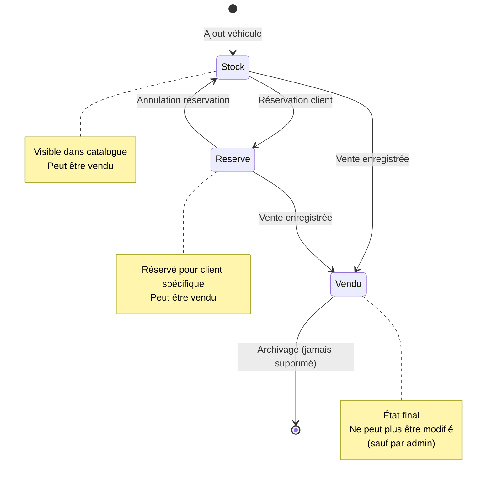
```mermaid
stateDiagram-v2
    [*] --> Stock : Ajout véhicule

    Stock --> Reserve : Réservation client
    Reserve --> Stock : Annulation réservation

    Stock --> Vendu : Vente enregistrée
    Reserve --> Vendu : Vente enregistrée

    Vendu --> [*] : Archivage (jamais supprimé)

    note right of Stock
        Visible dans catalogue
        Peut être vendu
    end note

    note right of Reserve
        Réservé pour client spécifique
        Peut être vendu
    end note

    note right of Vendu
        État final
        Ne peut plus être modifié
        (sauf par admin)
    end note
```

### 6.2 Cycle de Vie d'une Demande d'Achat

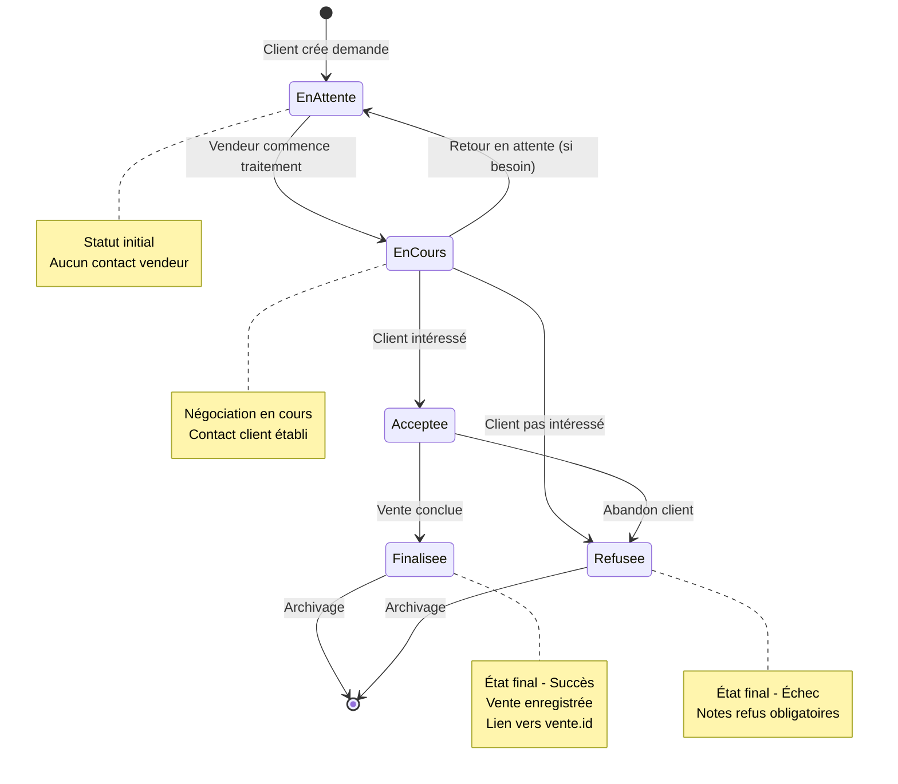
```mermaid
stateDiagram-v2
    [*] --> EnAttente : Client crée demande

    EnAttente --> EnCours : Vendeur commence traitement
    EnCours --> EnAttente : Retour en attente (si besoin)

    EnCours --> Acceptee : Client intéressé
    EnCours --> Refusee : Client pas intéressé

    Acceptee --> Finalisee : Vente conclue
    Acceptee --> Refusee : Abandon client

    Finalisee --> [*] : Archivage
    Refusee --> [*] : Archivage

    note right of EnAttente
        Statut initial
        Aucun contact vendeur
    end note

    note right of EnCours
        Négociation en cours
        Contact client établi
    end note

    note right of Finalisee
        État final - Succès
        Vente enregistrée
        Lien vers vente.id
    end note

    note right of Refusee
        État final - Échec
        Notes refus obligatoires
    end note
```

### 6.3 Cycle de Vie d'un Bulletin de Paie

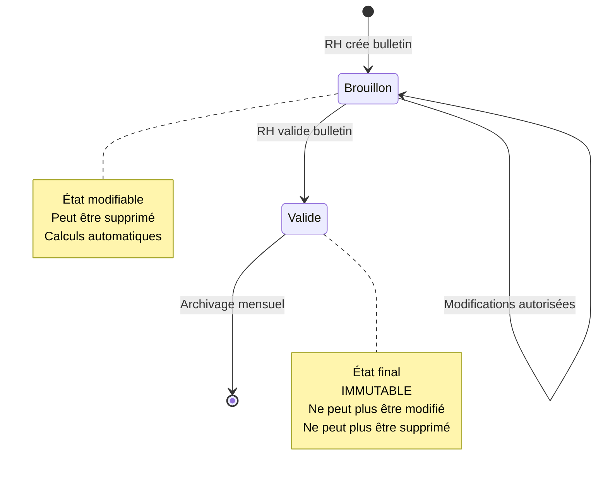
```mermaid
stateDiagram-v2
    [*] --> Brouillon : RH crée bulletin

    Brouillon --> Brouillon : Modifications autorisées
    Brouillon --> Valide : RH valide bulletin

    Valide --> [*] : Archivage mensuel

    note right of Brouillon
        État modifiable
        Peut être supprimé
        Calculs automatiques
    end note

    note right of Valide
        État final
        IMMUTABLE
        Ne peut plus être modifié
        Ne peut plus être supprimé
    end note
```

### 6.4 Cycle de Vie d'une Demande de Congés

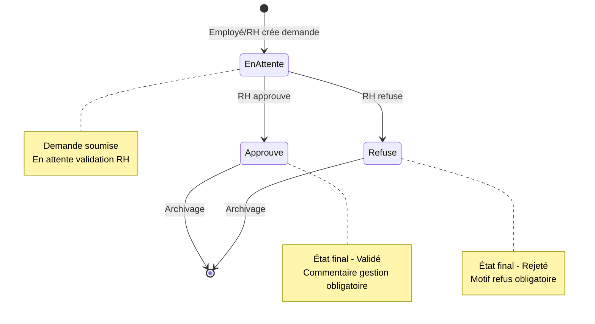
```mermaid
stateDiagram-v2
    [*] --> EnAttente : Employé/RH crée demande

    EnAttente --> Approuve : RH approuve
    EnAttente --> Refuse : RH refuse

    Approuve --> [*] : Archivage
    Refuse --> [*] : Archivage

    note right of EnAttente
        Demande soumise
        En attente validation RH
    end note

    note right of Approuve
        État final - Validé
        Commentaire gestion obligatoire
    end note

    note right of Refuse
        État final - Rejeté
        Motif refus obligatoire
    end note
```

---

## 7. Diagramme de Déploiement

### 7.1 Architecture Physique Production

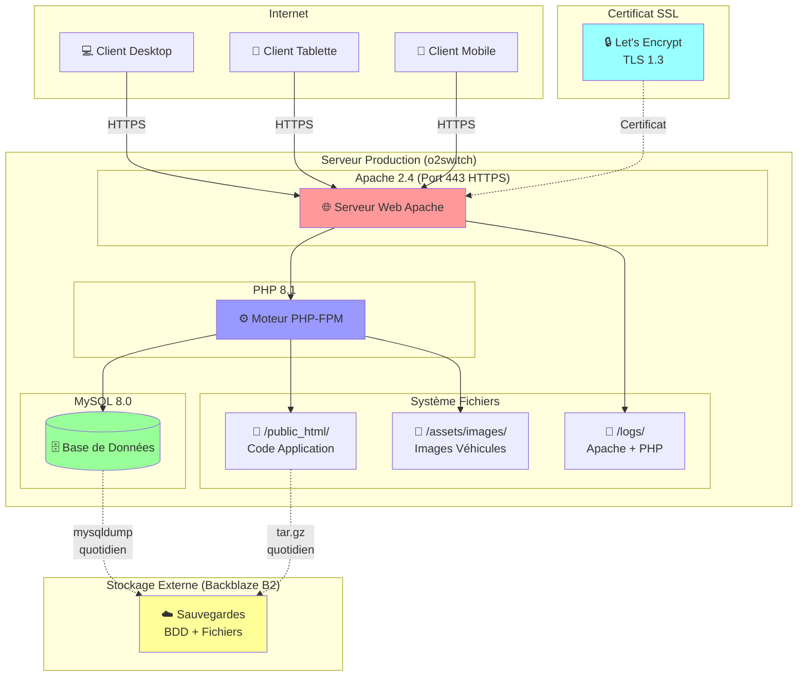
```mermaid
graph TB
    subgraph Internet
        CLIENT_DESK[💻 Client Desktop]
        CLIENT_TAB[📱 Client Tablette]
        CLIENT_MOB[📱 Client Mobile]
    end

    subgraph "Serveur Production (o2switch)"
        subgraph "Apache 2.4 (Port 443 HTTPS)"
            APACHE[🌐 Serveur Web Apache]
        end

        subgraph "PHP 8.1"
            PHP[⚙️ Moteur PHP-FPM]
        end

        subgraph "MySQL 8.0"
            MYSQL[(🗄️ Base de Données)]
        end

        subgraph "Système Fichiers"
            CODE[📁 /public_html/<br/>Code Application]
            UPLOADS[📁 /assets/images/<br/>Images Véhicules]
            LOGS[📄 /logs/<br/>Apache + PHP]
        end

        APACHE --> PHP
        PHP --> MYSQL
        PHP --> CODE
        PHP --> UPLOADS
        APACHE --> LOGS
    end

    subgraph "Stockage Externe (Backblaze B2)"
        BACKUP[☁️ Sauvegardes<br/>BDD + Fichiers]
    end

    subgraph "Certificat SSL"
        LETSENCRYPT[🔒 Let's Encrypt<br/>TLS 1.3]
    end

    CLIENT_DESK -->|HTTPS| APACHE
    CLIENT_TAB -->|HTTPS| APACHE
    CLIENT_MOB -->|HTTPS| APACHE

    LETSENCRYPT -.->|Certificat| APACHE

    MYSQL -.->|mysqldump<br/>quotidien| BACKUP
    CODE -.->|tar.gz<br/>quotidien| BACKUP

    style APACHE fill:#ff9999
    style PHP fill:#9999ff
    style MYSQL fill:#99ff99
    style BACKUP fill:#ffff99
    style LETSENCRYPT fill:#99ffff
```

### 7.2 Architecture Développement (Local)

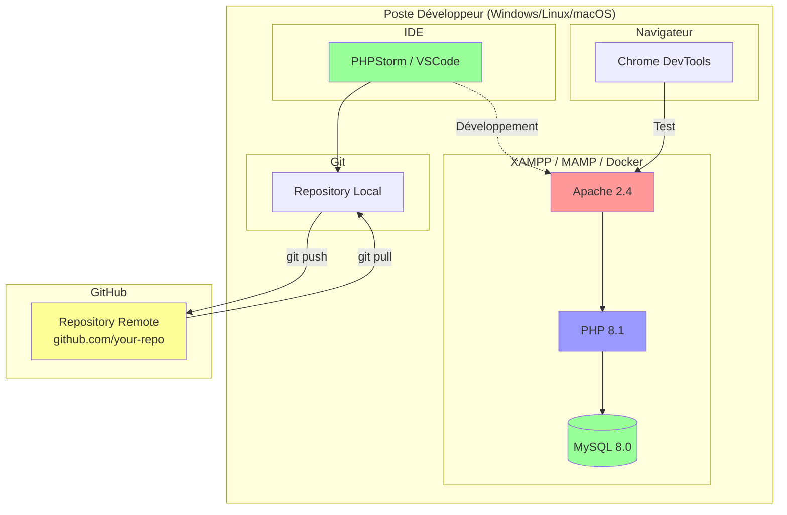
```mermaid
graph TB
    subgraph "Poste Développeur (Windows/Linux/macOS)"
        subgraph "XAMPP / MAMP / Docker"
            APACHE_DEV[Apache 2.4]
            PHP_DEV[PHP 8.1]
            MYSQL_DEV[(MySQL 8.0)]
        end

        subgraph "IDE"
            PHPSTORM[PHPStorm / VSCode]
        end

        subgraph "Navigateur"
            CHROME[Chrome DevTools]
        end

        subgraph "Git"
            GITLOCAL[Repository Local]
        end
    end

    subgraph "GitHub"
        GITREMOTE[Repository Remote<br/>github.com/your-repo]
    end

    PHPSTORM --> GITLOCAL
    GITLOCAL -->|git push| GITREMOTE
    GITREMOTE -->|git pull| GITLOCAL

    PHPSTORM -.->|Développement| APACHE_DEV
    APACHE_DEV --> PHP_DEV
    PHP_DEV --> MYSQL_DEV

    CHROME -->|Test| APACHE_DEV

    style PHPSTORM fill:#99ff99
    style APACHE_DEV fill:#ff9999
    style PHP_DEV fill:#9999ff
    style MYSQL_DEV fill:#99ff99
    style GITREMOTE fill:#ffff99
```

---

## 8. Diagramme de Packages (Organisation Code)

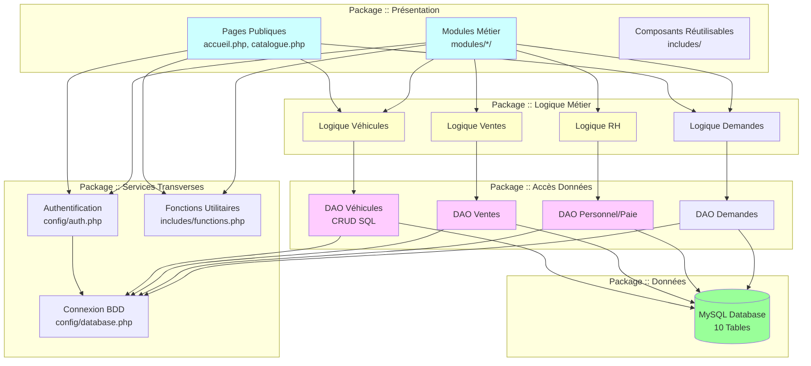
```mermaid
graph TB
    subgraph "Package :: Présentation"
        UI_PUBLIC[Pages Publiques<br/>accueil.php, catalogue.php]
        UI_MODULES[Modules Métier<br/>modules/*/]
        UI_INCLUDES[Composants Réutilisables<br/>includes/]
    end

    subgraph "Package :: Logique Métier"
        BIZ_VEHICULE[Logique Véhicules]
        BIZ_VENTE[Logique Ventes]
        BIZ_RH[Logique RH]
        BIZ_DEMANDE[Logique Demandes]
    end

    subgraph "Package :: Accès Données"
        DAO_VEHICULE[DAO Véhicules<br/>CRUD SQL]
        DAO_VENTE[DAO Ventes]
        DAO_RH[DAO Personnel/Paie]
        DAO_DEMANDE[DAO Demandes]
    end

    subgraph "Package :: Services Transverses"
        AUTH[Authentification<br/>config/auth.php]
        DB[Connexion BDD<br/>config/database.php]
        UTILS[Fonctions Utilitaires<br/>includes/functions.php]
    end

    subgraph "Package :: Données"
        MYSQL[(MySQL Database<br/>10 Tables)]
    end

    UI_PUBLIC --> BIZ_VEHICULE
    UI_PUBLIC --> BIZ_DEMANDE
    UI_MODULES --> BIZ_VEHICULE
    UI_MODULES --> BIZ_VENTE
    UI_MODULES --> BIZ_RH
    UI_MODULES --> BIZ_DEMANDE

    BIZ_VEHICULE --> DAO_VEHICULE
    BIZ_VENTE --> DAO_VENTE
    BIZ_RH --> DAO_RH
    BIZ_DEMANDE --> DAO_DEMANDE

    DAO_VEHICULE --> MYSQL
    DAO_VENTE --> MYSQL
    DAO_RH --> MYSQL
    DAO_DEMANDE --> MYSQL

    UI_PUBLIC --> AUTH
    UI_MODULES --> AUTH
    AUTH --> DB
    DAO_VEHICULE --> DB
    DAO_VENTE --> DB
    DAO_RH --> DB
    DAO_DEMANDE --> DB

    UI_PUBLIC --> UTILS
    UI_MODULES --> UTILS

    style UI_PUBLIC fill:#ccffff
    style UI_MODULES fill:#ccffff
    style BIZ_VEHICULE fill:#ffffcc
    style BIZ_VENTE fill:#ffffcc
    style BIZ_RH fill:#ffffcc
    style DAO_VEHICULE fill:#ffccff
    style DAO_VENTE fill:#ffccff
    style DAO_RH fill:#ffccff
    style MYSQL fill:#99ff99
```

---

## 9. Diagramme de Composants

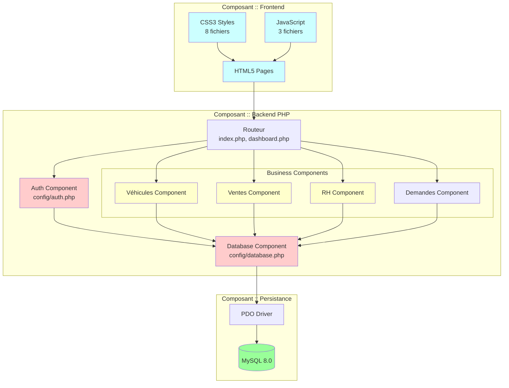
```mermaid
graph TB
    subgraph "Composant :: Frontend"
        HTML[HTML5 Pages]
        CSS[CSS3 Styles<br/>8 fichiers]
        JS[JavaScript<br/>3 fichiers]
    end

    subgraph "Composant :: Backend PHP"
        ROUTER[Routeur<br/>index.php, dashboard.php]
        AUTH_COMP[Auth Component<br/>config/auth.php]
        DB_COMP[Database Component<br/>config/database.php]

        subgraph "Business Components"
            VEH_COMP[Véhicules Component]
            VTE_COMP[Ventes Component]
            RH_COMP[RH Component]
            DEM_COMP[Demandes Component]
        end
    end

    subgraph "Composant :: Persistance"
        PDO[PDO Driver]
        MYSQL_COMP[(MySQL 8.0)]
    end

    HTML --> ROUTER
    CSS --> HTML
    JS --> HTML

    ROUTER --> AUTH_COMP
    AUTH_COMP --> DB_COMP

    ROUTER --> VEH_COMP
    ROUTER --> VTE_COMP
    ROUTER --> RH_COMP
    ROUTER --> DEM_COMP

    VEH_COMP --> DB_COMP
    VTE_COMP --> DB_COMP
    RH_COMP --> DB_COMP
    DEM_COMP --> DB_COMP

    DB_COMP --> PDO
    PDO --> MYSQL_COMP

    style HTML fill:#ccffff
    style CSS fill:#ccffff
    style JS fill:#ccffff
    style AUTH_COMP fill:#ffcccc
    style DB_COMP fill:#ffcccc
    style VEH_COMP fill:#ffffcc
    style VTE_COMP fill:#ffffcc
    style RH_COMP fill:#ffffcc
    style MYSQL_COMP fill:#99ff99
```

---

## 10. Matrice de Traçabilité (Exigences → Diagrammes)

| Exigence Fonctionnelle | Cas d'Utilisation | Diagramme Classes | Diagramme Séquence |
|------------------------|-------------------|-------------------|-------------------|
| **Gérer véhicules (CRUD)** | ✅ Section 2.1 | ✅ Classe Vehicule | - |
| **Enregistrer vente** | ✅ Section 2.2 | ✅ Classes Vente, Vehicule, Client | ✅ Section 4.1 |
| **Créer demande achat (client)** | ✅ Section 2.3 | ✅ Classe DemandeAchat | ✅ Section 4.2 |
| **Traiter demandes (vendeur)** | ✅ Section 2.3 | ✅ Classe DemandeAchat | - |
| **Authentification** | - | ✅ Classe Utilisateur | ✅ Section 4.3 |
| **Gérer permissions (RBAC)** | ✅ Section 2.1 | ✅ Classes Utilisateur, Permission | - |
| **Gérer personnel** | ✅ Section 2.1 | ✅ Classe Personnel | - |
| **Gérer congés** | ✅ Section 2.1 | ✅ Classe Conge | - |
| **Générer bulletins paie** | ✅ Section 2.1 | ✅ Classe BulletinPaie | ✅ Section 4.4 |
| **Consulter statistiques** | ✅ Section 2.1 | - | - |
| **Logs connexions** | - | ✅ Classe LogConnexion | ✅ Section 4.3 |

---

## 11. Validation et Approbation

### 11.1 Checklist de Validation

- [ ] Tous les cas d'utilisation majeurs sont modélisés
- [ ] Le diagramme de classes couvre toutes les entités BDD
- [ ] Les diagrammes de séquence illustrent les processus critiques
- [ ] Les états-transitions respectent les règles de gestion
- [ ] Le diagramme de déploiement est cohérent avec l'infrastructure
- [ ] La MOA valide que les modèles reflètent les besoins métier

### 11.2 Signatures

| Rôle | Nom | Signature | Date |
|------|-----|-----------|------|
| **Architecte Logiciel** | | | |
| **Lead Développeur** | | | |
| **Expert Métier (MOA)** | | | |
| **Chef de Projet** | | | |

---

## 12. Outils de Visualisation

### 12.1 Rendu Mermaid

**En ligne** :
- Mermaid Live Editor : https://mermaid.live/
- Markdown Preview Enhanced (VSCode)
- GitHub Markdown (rendu natif)

**Offline** :
- VSCode Extension : "Markdown Preview Mermaid Support"
- IntelliJ/PHPStorm Plugin : "Mermaid"

### 12.2 Export Diagrammes

**Formats supportés** :
- PNG (export image)
- SVG (vectoriel)
- PDF (via impression navigateur)

---

**Fin du document**

**Documentation complète PHASE 2 terminée !**
