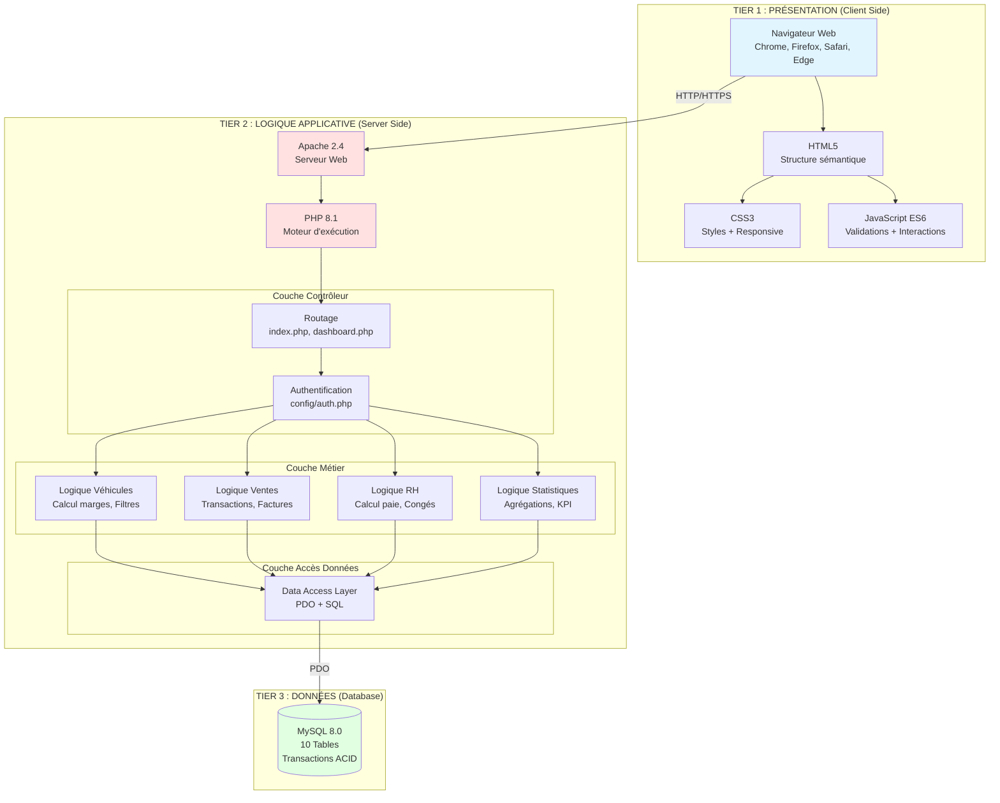
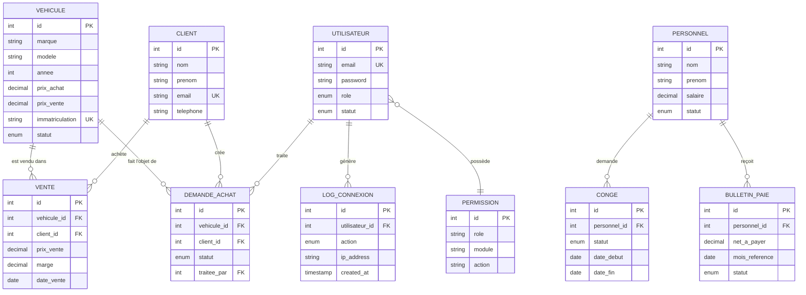

# Conception Architecturale - PGI Automobile

**Projet:** Progiciel de Gestion Intégré pour Concession Automobile
**Version:** 1.0 (Projet Académique)
**Date:** Novembre 2025
**Auteurs:** Thibaud & Melissa
**Contexte:** Projet de L3 - Période du 27/10/2025 au 17/11/2025 (3 semaines)
**Statut:** Validé

---

## 1. Introduction

### 1.1 Objet du Document

Ce document décrit l'architecture globale du PGI Automobile : architecture logique (présentation/métier/données), architecture physique (déploiement), modèle conceptuel de données (MCD) et choix d'architecture structurants.

### 1.2 Public Cible

- Architectes logiciels
- Équipe de développement
- Administrateurs système
- Auditeurs techniques

### 1.3 Références

- Spécifications Techniques v1.0
- Modèles UML v1.0
- Cahier des charges v1.0

---

## 2. Architecture Logique

### 2.1 Architecture 3-Tiers Simplifiée

Le PGI Automobile suit une architecture en **3 couches** classique, adaptée au contexte PHP natif sans framework.



### 2.2 Responsabilités par Couche

| Couche | Responsabilités | Technologies | Exemples |
|--------|----------------|--------------|----------|
| **Présentation** | - Affichage interface utilisateur<br/>- Capture interactions<br/>- Validation côté client<br/>- Responsive design | HTML5, CSS3, JavaScript | Formulaire ajout véhicule<br/>Tableau liste ventes<br/>Graphiques statistiques |
| **Logique Applicative** | - Routage requêtes<br/>- Authentification/Autorisation<br/>- Logique métier<br/>- Validation côté serveur<br/>- Orchestration transactions | PHP 8.1, PDO | Vérification permissions<br/>Calcul marge vente<br/>Transaction SQL vente<br/>Génération bulletin paie |
| **Données** | - Persistance données<br/>- Intégrité référentielle<br/>- Transactions ACID<br/>- Optimisation requêtes | MySQL 8.0 | Tables relationnelles<br/>Contraintes FK<br/>Indexes |

### 2.3 Flux de Données

#### Exemple : Enregistrement d'une Vente

```
┌─────────────────────────────────────────────────────────────────┐
│ 1. PRÉSENTATION                                                 │
│    Vendeur remplit formulaire vente → Soumission POST           │
└────────────────────────┬────────────────────────────────────────┘
                         ↓
┌─────────────────────────────────────────────────────────────────┐
│ 2. CONTRÔLEUR (modules/ventes/ajouter.php)                      │
│    - Récupération $_POST                                        │
│    - Vérification session (requireAuth)                         │
│    - Vérification permission (requirePermission 'ventes:create')│
└────────────────────────┬────────────────────────────────────────┘
                         ↓
┌─────────────────────────────────────────────────────────────────┐
│ 3. LOGIQUE MÉTIER                                               │
│    - Validation données (prix > 0, dates valides)               │
│    - Calcul marge = prix_vente - vehicule.prix_achat           │
│    - Vérification véhicule disponible (statut stock/réservé)    │
└────────────────────────┬────────────────────────────────────────┘
                         ↓
┌─────────────────────────────────────────────────────────────────┐
│ 4. ACCÈS DONNÉES (PDO)                                          │
│    BEGIN TRANSACTION                                            │
│    - INSERT INTO ventes (...)                                   │
│    - UPDATE vehicules SET statut='vendu' WHERE id=?             │
│    COMMIT                                                       │
└────────────────────────┬────────────────────────────────────────┘
                         ↓
┌─────────────────────────────────────────────────────────────────┐
│ 5. BASE DE DONNÉES (MySQL)                                      │
│    - Insertion enregistrement vente                             │
│    - Mise à jour statut véhicule                                │
│    - Vérification contraintes FK (client_id, vehicule_id)       │
└────────────────────────┬────────────────────────────────────────┘
                         ↓
┌─────────────────────────────────────────────────────────────────┐
│ 6. RETOUR PRÉSENTATION                                          │
│    - Redirection /modules/ventes/liste.php                      │
│    - Affichage message succès "✅ Vente enregistrée !"          │
└─────────────────────────────────────────────────────────────────┘
```

---

## 3. Architecture Physique

### 3.1 Diagramme de Déploiement Production

```mermaid
graph TB
    subgraph "Zone Internet"
        USER_DESK[👨‍💼 Utilisateur Desktop<br/>1920x1080]
        USER_TAB[📱 Utilisateur Tablette<br/>768x1024]
        USER_MOB[📱 Utilisateur Mobile<br/>375x667]
    end

    subgraph "DMZ - Serveur Web (o2switch)"
        LB[⚖️ Load Balancer<br/>(optionnel)]

        subgraph "Serveur Apache"
            APACHE_PROD[🌐 Apache 2.4<br/>:443 HTTPS<br/>:80 HTTP → Redirect]
            MODSEC[🛡️ ModSecurity WAF<br/>(optionnel)]
        end

        subgraph "Application PHP"
            PHP_FPM[⚙️ PHP-FPM 8.1<br/>Process Manager]
            OPCACHE[💾 OpCache<br/>Cache bytecode]
        end

        subgraph "Fichiers"
            CODE_PROD[📁 /public_html/<br/>Code Application]
            UPLOADS_PROD[📁 /assets/images/<br/>Images Véhicules]
        end
    end

    subgraph "Zone Base de Données (localhost)"
        MYSQL_PROD[(🗄️ MySQL 8.0<br/>Port 3306<br/>Accès local uniquement)]
    end

    subgraph "Sauvegardes Externes"
        BACKUP_LOCAL[💾 Backups Locaux<br/>/home/user/backups/<br/>Rétention 7 jours]
        BACKUP_CLOUD[☁️ Backblaze B2<br/>Backups distants<br/>Rétention 30 jours]
    end

    subgraph "Certificats SSL"
        LETSENCRYPT[🔒 Let's Encrypt<br/>Certificat SSL/TLS<br/>Auto-renew]
    end

    subgraph "Monitoring (Futur)"
        UPTIME[📊 UptimeRobot<br/>Monitoring disponibilité]
        LOGS_EXTERN[📋 Sentry<br/>Logs erreurs]
    end

    USER_DESK -->|HTTPS| LB
    USER_TAB -->|HTTPS| LB
    USER_MOB -->|HTTPS| LB

    LB --> APACHE_PROD
    APACHE_PROD --> MODSEC
    MODSEC --> PHP_FPM
    PHP_FPM --> OPCACHE
    PHP_FPM --> CODE_PROD
    PHP_FPM --> UPLOADS_PROD
    PHP_FPM -->|PDO TCP| MYSQL_PROD

    LETSENCRYPT -.->|Certificat| APACHE_PROD

    MYSQL_PROD -.->|mysqldump<br/>Cron 3h| BACKUP_LOCAL
    CODE_PROD -.->|tar.gz<br/>Cron 3h| BACKUP_LOCAL
    BACKUP_LOCAL -.->|rsync daily| BACKUP_CLOUD

    APACHE_PROD -.->|HTTP Check| UPTIME
    PHP_FPM -.->|Error Logs| LOGS_EXTERN

    style APACHE_PROD fill:#ff9999
    style PHP_FPM fill:#9999ff
    style MYSQL_PROD fill:#99ff99
    style BACKUP_CLOUD fill:#ffff99
    style LETSENCRYPT fill:#99ffff
```

### 3.2 Environnements

| Environnement | URL | Serveur | Base de Données | Objectif |
|---------------|-----|---------|-----------------|----------|
| **Développement** | `http://localhost` | XAMPP/MAMP (local) | `pgi_automobile_dev` | Développement actif |
| **Test** | `https://test.pgi-auto.fr` | VPS dédié | `pgi_automobile_test` | Tests QA, recette |
| **Production** | `https://www.pgi-auto.fr` | o2switch Unique | `pgi_automobile_prod` | Exploitation réelle |

### 3.3 Topologie Réseau Production

```
┌────────────────────────────────────────────────────────────┐
│                     INTERNET                               │
│                         ↓                                  │
│                   Pare-feu OVH                             │
│                         ↓                                  │
│  ┌──────────────────────────────────────────────────┐     │
│  │ Serveur Web (IP Publique : 51.XX.XX.XX)         │     │
│  │                                                  │     │
│  │  ┌─────────────────────────────────────────┐    │     │
│  │  │ Apache (Port 443 HTTPS, Port 80 HTTP)  │    │     │
│  │  └─────────────────┬───────────────────────┘    │     │
│  │                    ↓                             │     │
│  │  ┌─────────────────────────────────────────┐    │     │
│  │  │ PHP-FPM (Unix Socket)                   │    │     │
│  │  └─────────────────┬───────────────────────┘    │     │
│  │                    ↓                             │     │
│  │  ┌─────────────────────────────────────────┐    │     │
│  │  │ MySQL (127.0.0.1:3306)                  │    │     │
│  │  │ Accès UNIQUEMENT depuis localhost       │    │     │
│  │  └─────────────────────────────────────────┘    │     │
│  │                                                  │     │
│  └──────────────────────────────────────────────────┘     │
│                         ↓                                  │
│  ┌──────────────────────────────────────────────────┐     │
│  │ Backblaze B2 (Stockage Cloud - Sauvegardes)     │     │
│  └──────────────────────────────────────────────────┘     │
└────────────────────────────────────────────────────────────┘
```

**Règles de Sécurité** :
- ✅ MySQL écoute UNIQUEMENT sur `127.0.0.1` (pas d'accès externe)
- ✅ Port 3306 bloqué par firewall
- ✅ Accès SSH uniquement par clé (pas de mot de passe)
- ✅ Fail2Ban actif (blocage automatique tentatives bruteforce)

---

## 4. Modèle Conceptuel de Données (MCD)

### 4.1 Entités Principales

Le MCD identifie **10 entités métier** :



### 4.2 Cardinalités et Relations

| Relation | Cardinalité | Contrainte |
|----------|-------------|------------|
| **VEHICULE → VENTE** | 1:N | Un véhicule peut être vendu une seule fois (statut = vendu) |
| **VEHICULE → DEMANDE_ACHAT** | 1:N | Un véhicule peut avoir plusieurs demandes |
| **CLIENT → VENTE** | 1:N | Un client peut acheter plusieurs véhicules |
| **CLIENT → DEMANDE_ACHAT** | 1:N | Un client peut créer plusieurs demandes |
| **UTILISATEUR → DEMANDE_ACHAT** | 1:N | Un vendeur traite plusieurs demandes |
| **UTILISATEUR → LOG_CONNEXION** | 1:N | Un utilisateur génère plusieurs logs |
| **UTILISATEUR → PERMISSION** | N:N | Via table permissions (rôle) |
| **PERSONNEL → CONGE** | 1:N | Un employé a plusieurs demandes de congés |
| **PERSONNEL → BULLETIN_PAIE** | 1:N | Un employé reçoit un bulletin par mois |

### 4.3 Règles de Gestion (Contraintes Métier)

| ID | Règle | Implémentation |
|----|-------|----------------|
| **RG-MCD-01** | Un véhicule vendu ne peut être supprimé | FK `ON DELETE RESTRICT` |
| **RG-MCD-02** | Un client ayant des ventes ne peut être supprimé | FK `ON DELETE RESTRICT` |
| **RG-MCD-03** | Un employé supprimé voit ses congés/paies supprimés | FK `ON DELETE CASCADE` |
| **RG-MCD-04** | Un bulletin de paie est unique par employé par mois | UNIQUE (personnel_id, mois_reference) |
| **RG-MCD-05** | L'immatriculation véhicule est unique | UNIQUE (immatriculation) |
| **RG-MCD-06** | L'email utilisateur/client est unique | UNIQUE (email) |
| **RG-MCD-07** | Une permission est unique par (rôle, module, action) | UNIQUE (role, module, action) |

---

## 5. Choix d'Architecture

### 5.1 Approche Monolithique vs Microservices

**Choix Retenu : Monolithe Modulaire**

```
┌────────────────────────────────────────────────────────────┐
│                  APPLICATION MONOLITHIQUE                   │
│                                                            │
│  ┌──────────┐ ┌──────────┐ ┌──────────┐ ┌──────────┐     │
│  │ Module   │ │ Module   │ │ Module   │ │ Module   │     │
│  │Véhicules │ │  Ventes  │ │    RH    │ │  Admin   │     │
│  └────┬─────┘ └────┬─────┘ └────┬─────┘ └────┬─────┘     │
│       │            │            │            │            │
│       └────────────┴────────────┴────────────┘            │
│                      ↓                                     │
│            ┌──────────────────────┐                        │
│            │  Base de Données     │                        │
│            │  Unique (MySQL)      │                        │
│            └──────────────────────┘                        │
└────────────────────────────────────────────────────────────┘
```

**Justification** :

| Critère | Monolithe | Microservices | Choix |
|---------|-----------|---------------|-------|
| **Complexité développement** | ✅ Simple | ❌ Complexe | Monolithe |
| **Déploiement** | ✅ Un seul artefact | ❌ N services | Monolithe |
| **Performance** | ✅ Appels locaux | ⚠️ Appels réseau | Monolithe |
| **Coût hébergement** | ✅ 1 serveur | ❌ N serveurs | Monolithe |
| **Scalabilité** | ⚠️ Verticale uniquement | ✅ Horizontale | Acceptable pour volumétrie |
| **Équipe** | ✅ 2 dev suffisants | ❌ Équipes multiples | Monolithe |

**Avantages Monolithe pour ce Projet** :
- Simplicité développement et maintenance
- Transactions ACID natives (pas de distributed transactions)
- Déploiement simple (un seul fichier ZIP)
- Debugging facile (un seul process)
- Coût infrastructure réduit

### 5.2 Pattern MVC vs Alternatives

**Choix Retenu : MVC Simplifié (sans framework)**

**Comparaison** :

| Pattern | Avantages | Inconvénients | Verdict |
|---------|-----------|---------------|---------|
| **MVC pur (Laravel, Symfony)** | Séparation stricte, routing avancé, ORM | Dépendances lourdes, courbe apprentissage | ❌ Trop complexe |
| **MVC simplifié (natif)** | Contrôle total, pas de dépendances, léger | Scaffolding manuel | ✅ **Retenu** |
| **HMVC (Hierarchical)** | Réutilisabilité composants | Complexité accrue | ❌ Overkill |
| **ADR (Action-Domain-Responder)** | Moderne, adapté APIs | Peu connu, pas standard | ❌ Non standard |

**Implémentation MVC Simplifié** :

```php
// Fichier : modules/ventes/ajouter.php
<?php
// === CONTRÔLEUR ===
require_once '../../config/database.php';
require_once '../../config/auth.php';

requireAuth();
requirePermission('ventes', 'create');

// Traitement POST
if ($_SERVER['REQUEST_METHOD'] === 'POST') {
    // === MODÈLE (inline) ===
    $vehicule_id = $_POST['vehicule_id'];
    $client_id = $_POST['client_id'];
    $prix_vente = $_POST['prix_vente'];

    // Validation
    if ($prix_vente <= 0) {
        $error = "Prix invalide";
    } else {
        // Récupération prix achat véhicule
        $stmt = $pdo->prepare("SELECT prix_achat FROM vehicules WHERE id = ?");
        $stmt->execute([$vehicule_id]);
        $vehicule = $stmt->fetch();

        $marge = $prix_vente - $vehicule['prix_achat'];

        // Transaction
        $pdo->beginTransaction();
        try {
            // Insertion vente
            $stmt = $pdo->prepare("INSERT INTO ventes (vehicule_id, client_id, prix_vente, marge, date_vente) VALUES (?, ?, ?, ?, NOW())");
            $stmt->execute([$vehicule_id, $client_id, $prix_vente, $marge]);

            // Mise à jour statut véhicule
            $stmt = $pdo->prepare("UPDATE vehicules SET statut = 'vendu' WHERE id = ?");
            $stmt->execute([$vehicule_id]);

            $pdo->commit();
            header('Location: liste.php?success=1');
            exit;
        } catch (Exception $e) {
            $pdo->rollBack();
            $error = "Erreur : " . $e->getMessage();
        }
    }
}

// === VUE ===
include '../../includes/header.php';
?>
<h1>Nouvelle Vente</h1>
<?php if (isset($error)): ?>
    <div class="alert error"><?= escape($error) ?></div>
<?php endif; ?>
<form method="POST">
    <!-- Formulaire HTML -->
</form>
<?php include '../../includes/footer.php'; ?>
```

### 5.3 Gestion des Sessions

**Choix Retenu : Sessions PHP Natives**

**Alternatives évaluées** :

| Méthode | Stockage | Scalabilité | Sécurité | Verdict |
|---------|----------|-------------|----------|---------|
| **Sessions PHP (fichiers)** | `/tmp` | ⚠️ Mono-serveur | ✅ Native | ✅ **Retenu** |
| **Sessions PHP (Redis)** | Redis | ✅ Multi-serveurs | ✅ Rapide | ⚠️ Future |
| **JWT Tokens** | Client (Cookie/LocalStorage) | ✅ Stateless | ⚠️ XSS risk | ❌ Complexe |
| **Sessions DB (MySQL)** | Table `sessions` | ✅ Multi-serveurs | ✅ Persistant | ⚠️ Lent |

**Configuration Sessions** (`php.ini`) :

```ini
session.save_handler = files
session.save_path = "/var/lib/php/sessions"
session.gc_maxlifetime = 3600          ; 1 heure
session.cookie_httponly = 1            ; Anti-XSS
session.cookie_secure = 1              ; HTTPS uniquement (prod)
session.use_strict_mode = 1            ; Sécurité
session.cookie_samesite = "Strict"     ; Anti-CSRF
```

**Migration Future vers Redis** (si besoin scalabilité) :

```ini
session.save_handler = redis
session.save_path = "tcp://127.0.0.1:6379"
```

### 5.4 Gestion des Transactions

**Choix Retenu : Transactions SQL Explicites (PDO)**

**Exemple Transaction Vente** :

```php
$pdo->beginTransaction();
try {
    // Opération 1 : Insertion vente
    $stmt = $pdo->prepare("INSERT INTO ventes (...) VALUES (...)");
    $stmt->execute([...]);

    // Opération 2 : Mise à jour véhicule
    $stmt = $pdo->prepare("UPDATE vehicules SET statut = 'vendu' WHERE id = ?");
    $stmt->execute([$vehicule_id]);

    // Opération 3 : Log (optionnel)
    $stmt = $pdo->prepare("INSERT INTO logs_ventes (...) VALUES (...)");
    $stmt->execute([...]);

    $pdo->commit();
} catch (Exception $e) {
    $pdo->rollBack();
    throw $e;
}
```

**Propriétés ACID Garanties** :
- **Atomicité** : Tout ou rien (commit ou rollback)
- **Cohérence** : Contraintes FK respectées
- **Isolation** : Niveau READ COMMITTED par défaut MySQL
- **Durabilité** : Commit persiste sur disque

### 5.5 Gestion des Fichiers (Uploads)

**Choix Retenu : Stockage Système de Fichiers Local**

**Alternatives** :

| Méthode | Coût | Scalabilité | Complexité | Verdict |
|---------|------|-------------|------------|---------|
| **Fichiers locaux** (`/assets/images/`) | Gratuit | ⚠️ Mono-serveur | ✅ Simple | ✅ **Retenu** |
| **Stockage objet (S3, B2)** | ~5€/mois | ✅ Illimité | ⚠️ SDK requis | ⚠️ Future |
| **CDN (Cloudflare)** | ~10€/mois | ✅ Global | ⚠️ Configuration | ⚠️ Future |
| **BDD (BLOB)** | Gratuit | ❌ Lent | ⚠️ Complexe | ❌ Non recommandé |

**Implémentation Upload** :

```php
// modules/vehicules/ajouter.php
if (isset($_FILES['image']) && $_FILES['image']['error'] === UPLOAD_ERR_OK) {
    $allowed = ['jpg', 'jpeg', 'png', 'webp'];
    $ext = strtolower(pathinfo($_FILES['image']['name'], PATHINFO_EXTENSION));

    if (in_array($ext, $allowed) && $_FILES['image']['size'] <= 5 * 1024 * 1024) {
        $filename = uniqid('vehicule_') . '.' . $ext;
        $destination = __DIR__ . '/../../assets/images/vehicules/' . $filename;

        if (move_uploaded_file($_FILES['image']['tmp_name'], $destination)) {
            $image_url = '/assets/images/vehicules/' . $filename;
            // Stockage $image_url en BDD
        }
    }
}
```

**Sécurité Uploads** :
- ✅ Validation extension (whitelist)
- ✅ Limite taille (5 MB)
- ✅ Renommage fichier (uniqid - pas de nom original)
- ✅ Stockage hors webroot recommandé (ou .htaccess deny)
- ⚠️ Future : Scan antivirus (ClamAV)

---

## 6. Patterns de Conception Utilisés

### 6.1 Singleton (Connexion BDD)

**Objectif** : Une seule instance PDO partagée

```php
// config/database.php
class Database {
    private static $instance = null;

    public static function getInstance() {
        if (self::$instance === null) {
            self::$instance = new PDO(
                "mysql:host=" . DB_HOST . ";dbname=" . DB_NAME,
                DB_USER,
                DB_PASS,
                [
                    PDO::ATTR_ERRMODE => PDO::ERRMODE_EXCEPTION,
                    PDO::ATTR_DEFAULT_FETCH_MODE => PDO::FETCH_ASSOC,
                    PDO::ATTR_EMULATE_PREPARES => false
                ]
            );
        }
        return self::$instance;
    }
}

$pdo = Database::getInstance();
```

### 6.2 Front Controller (Routage)

**Objectif** : Point d'entrée unique

```php
// index.php (simplifié)
session_start();
require_once 'config/auth.php';

if (!isset($_SESSION['user_id'])) {
    header('Location: login.php');
    exit;
}

// Routage selon rôle
$role = $_SESSION['role'];
switch ($role) {
    case 'admin':
        header('Location: modules/admin/utilisateurs.php');
        break;
    case 'vendeur':
        header('Location: modules/ventes/liste.php');
        break;
    // ...
}
```

### 6.3 Template View (Includes)

**Objectif** : Réutilisation composants UI

```php
// includes/header.php
<!DOCTYPE html>
<html>
<head>
    <title><?= $page_title ?? 'PGI Automobile' ?></title>
    <link rel="stylesheet" href="/assets/css/style.css">
</head>
<body>
    <header>
        <nav>
            <?php if (hasPermission('vehicules', 'read')): ?>
                <a href="/modules/vehicules/liste.php">Véhicules</a>
            <?php endif; ?>
            <!-- Menu dynamique selon permissions -->
        </nav>
    </header>
    <main>
```

```php
// includes/footer.php
    </main>
    <footer>
        <p>&copy; 2025 PGI Automobile</p>
    </footer>
</body>
</html>
```

### 6.4 Strategy (Calcul Marge)

**Objectif** : Différentes stratégies de calcul

```php
interface MargeCalculator {
    public function calculer($prix_achat, $prix_vente);
}

class MargeStandard implements MargeCalculator {
    public function calculer($prix_achat, $prix_vente) {
        return $prix_vente - $prix_achat;
    }
}

class MargePourcentage implements MargeCalculator {
    public function calculer($prix_achat, $prix_vente) {
        return (($prix_vente - $prix_achat) / $prix_achat) * 100;
    }
}

// Utilisation
$calculator = new MargeStandard();
$marge = $calculator->calculer(15000, 18500); // 3500€
```

---

## 7. Sécurité Architecture

### 7.1 Défense en Profondeur

```
┌───────────────────────────────────────────────────────────┐
│ COUCHE 1 : Réseau / Infrastructure                        │
│ - Pare-feu serveur (iptables, fail2ban)                   │
│ - HTTPS obligatoire (TLS 1.3)                             │
│ - Ports non essentiels fermés                             │
└───────────────────────┬───────────────────────────────────┘
                        ↓
┌───────────────────────────────────────────────────────────┐
│ COUCHE 2 : Serveur Web (Apache)                           │
│ - ModSecurity WAF (optionnel)                             │
│ - Rate limiting (mod_evasive)                             │
│ - Headers sécurité (HSTS, X-Frame-Options)                │
└───────────────────────┬───────────────────────────────────┘
                        ↓
┌───────────────────────────────────────────────────────────┐
│ COUCHE 3 : Application (PHP)                              │
│ - Authentification (sessions sécurisées)                  │
│ - Autorisation (RBAC granulaire)                          │
│ - Validation inputs (whitelist)                           │
│ - Échappement outputs (htmlspecialchars)                  │
└───────────────────────┬───────────────────────────────────┘
                        ↓
┌───────────────────────────────────────────────────────────┐
│ COUCHE 4 : Base de Données                                │
│ - Requêtes préparées (PDO)                                │
│ - Principe moindre privilège (user pgi_user)              │
│ - Accès localhost uniquement                              │
│ - Sauvegardes chiffrées                                   │
└───────────────────────────────────────────────────────────┘
```

### 7.2 Headers Sécurité HTTP

**Configuration Apache** (`.htaccess`) :

```apache
<IfModule mod_headers.c>
    # Strict Transport Security (HSTS)
    Header always set Strict-Transport-Security "max-age=31536000; includeSubDomains"

    # Prévention clickjacking
    Header always set X-Frame-Options "SAMEORIGIN"

    # Protection XSS navigateur
    Header always set X-XSS-Protection "1; mode=block"

    # Pas de sniffing MIME
    Header always set X-Content-Type-Options "nosniff"

    # Contrôle référent
    Header always set Referrer-Policy "strict-origin-when-cross-origin"

    # Content Security Policy (CSP)
    Header always set Content-Security-Policy "default-src 'self'; script-src 'self' 'unsafe-inline'; style-src 'self' 'unsafe-inline';"
</IfModule>
```

### 7.3 Principe du Moindre Privilège

**Utilisateur MySQL Applicatif** :

```sql
-- Création utilisateur avec privilèges minimaux
CREATE USER 'pgi_user'@'localhost' IDENTIFIED BY 'StrongPassword123!';
GRANT SELECT, INSERT, UPDATE, DELETE ON pgi_automobile.* TO 'pgi_user'@'localhost';
-- Pas de DROP, CREATE, ALTER

FLUSH PRIVILEGES;
```

**Permissions Fichiers** :

```bash
# Code application : lecture seule
find /public_html -type f -exec chmod 644 {} \;
find /public_html -type d -exec chmod 755 {} \;

# Uploads : écriture nécessaire
chmod 755 /public_html/assets/images/vehicules/

# Config : accès restreint
chmod 600 /public_html/.env
```

---

## 8. Performance et Optimisation

### 8.1 Stratégie de Cache

```
┌────────────────────────────────────────────────────────────┐
│ NIVEAU 1 : Cache Navigateur (Client Side)                 │
│ - CSS/JS/Images : Cache-Control max-age=2592000 (30j)     │
│ - HTML dynamique : no-cache                                │
└────────────────────────┬───────────────────────────────────┘
                         ↓
┌────────────────────────────────────────────────────────────┐
│ NIVEAU 2 : OpCache PHP (Bytecode)                         │
│ - Cache compilation scripts PHP                            │
│ - Gain ~30% performance                                    │
│ - Invalidation automatique modification fichiers           │
└────────────────────────┬───────────────────────────────────┘
                         ↓
┌────────────────────────────────────────────────────────────┐
│ NIVEAU 3 : Sessions PHP (Données Utilisateur)             │
│ - Stockage : Fichiers /tmp (ou Redis futur)               │
│ - TTL : 1 heure (3600s)                                    │
└────────────────────────┬───────────────────────────────────┘
                         ↓
┌────────────────────────────────────────────────────────────┐
│ NIVEAU 4 : Query Cache MySQL (Désactivé MySQL 8)          │
│ - Pas de cache requête (deprecated MySQL 8)               │
│ - Optimisation via indexes                                 │
└────────────────────────────────────────────────────────────┘
```

### 8.2 Optimisations Requêtes

**Exemple : Liste Véhicules avec Filtres**

```sql
-- Requête optimisée avec indexes
EXPLAIN SELECT
    v.*,
    (v.prix_vente - v.prix_achat) AS marge
FROM vehicules v
WHERE v.statut = 'stock'           -- INDEX idx_statut
  AND v.type_vehicule = 'SUV'      -- INDEX idx_type
  AND v.marque LIKE 'Peugeot%'     -- INDEX idx_marque
ORDER BY v.created_at DESC
LIMIT 50 OFFSET 0;                 -- Pagination

-- Résultat EXPLAIN :
-- type: ref (utilise indexes)
-- rows: ~10 (sur 100 total)
-- Extra: Using where; Using index
```

### 8.3 Lazy Loading Images

**HTML** :

```html

```

**Bénéfice** : Chargement différé images hors viewport (économie bande passante)

---

## 9. Validation et Approbation

### 9.1 Checklist de Validation

- [ ] Architecture 3-tiers clairement définie
- [ ] Diagramme de déploiement production validé
- [ ] MCD complet avec toutes entités et relations
- [ ] Choix architecturaux justifiés
- [ ] Patterns de conception identifiés
- [ ] Sécurité multicouche implémentée
- [ ] Stratégie cache définie
- [ ] Plan scalabilité future documenté

### 9.2 Signatures

| Rôle | Nom | Signature | Date |
|------|-----|-----------|------|
| **Architecte Logiciel** | | | |
| **Lead Développeur** | | | |
| **Administrateur Système** | | | |
| **Chef de Projet** | | | |

---

**Fin du document**

**Prochaine étape** : Conception Détaillée (MLD, algorithmes, structures)
